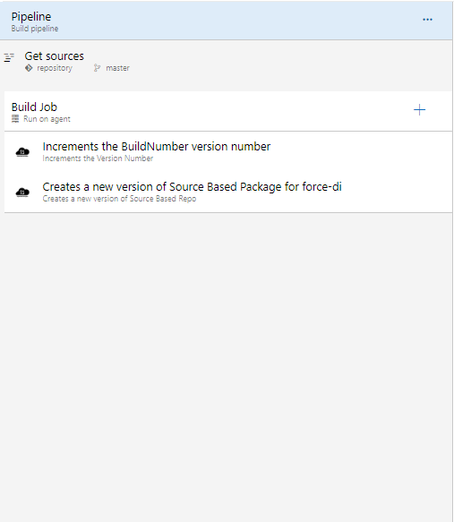

# Build Pipeline - Org Based Deployment

This pipeline demonstrates how you can build a continuous integration pipeline for if you are using  an [org model of development](https://trailhead.salesforce.com/en/content/learn/modules/org-development-model)  . In an  Org based deployment, one typically deploys the source directly to an org , hence there is no need of build stage. However as mentioned in [principles](../../principles-1.md#generate-artifacts-on-build-stage), we believe only versioned artifacts should be utilized in a deployment stage. Therefore, the pipeline has tasks that creates an artifact which is bounded to the particular merge.

[This pipeline](https://raw.githubusercontent.com/azlamsalam/sfpowerscripts/release/SamplePipelines/sfpowerscripts-sample-pipelines/BuildDefinitions/Source%20Package%20Build%20using%20sfpowerscripts.json) is triggered on every successful completion of a feature branch into the develop/master branch. If the frequency is quite high, you can look into utilizing `[ci skip]` in front of the commit message to skip a trigger of this pipeline

> The pipeline demonstrated below is a quite a simple one, assuming there is only one package directory in your project. If you are having a mono repo with multiple package directories, the PR validation Job will feature multiple create version tasks. You can also have source packages along with unlocked packages in the same project directory


 Here is a snapshot of the steps we have used to configure a pipeline. 

**Pipeline Snapshot**

The pipeline is available as part of the sample pipelines.







```text

jobs:
    
    - job: Build a Source Package
      displayName: Source  Package build  for <MyPackage>
      condition: and(eq(variables[\'build.sourceBranch\'], \'refs/heads/master\'), ne(variables[\'build.Reason\'], \'PullRequest\') )
     
       steps:
 
        - task: sfpwowerscript-incrementversionnumber-task@<version>
          displayName: 'Increments the BuildNumber version number '
          inputs:
            commit_changes: true

        - task: sfpwowerscripts-createsourcepackage-task@<version>
          displayName: 'Creates a new version of source baed repo for force-di'
          inputs:
           package: <MyPackage>
           version_number: 'build.sfpowerscripts_incremented_project_version'

        
```



**Tasks Involved**

The steps that are part of this pipeline are \(in the exact order\)

1. [Increment the version number](../task-specifications/utility-tasks/increment-version-number-of-a-package.md) \( optional step, if you want to increment the build number or any segment number\)
2. [Create a new version of the source package](../task-specifications/packaging-tasks/create-source-based-package.md)



This pipeline need to be enabled only with CI triggers, PR triggers for pipeline should be disabled. Follow this  documentation to enable this CI trigger using this [link](https://docs.microsoft.com/en-us/azure/devops/pipelines/build/triggers?view=azure-devops&tabs=classic)


