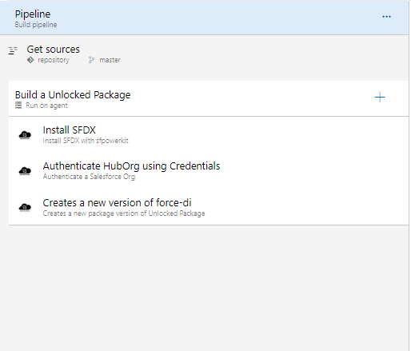

# Build Pipeline - Unlocked Package

This pipeline demonstrates how you can build a continous integration pipeline for an unlocked package. 

[This pipeline](https://raw.githubusercontent.com/azlamsalam/sfpowerscripts/release/SamplePipelines/sfpowerscripts-sample-pipelines/BuildDefinitions/Unlocked%20Package%20Build%20using%20sfpowerscript.json) is triggered on every successful completion of a feature branch into the develop/master branch. If the frequency is quite high, you can look into utilizing \[ci skip\] in front of the commit message to skip a trigger of this pipeline

> The pipeline demonstrated below is a quite simple one, assuming there is only one package directory in your project. If you are having a mono repo with multiple package directories, the PR validation Job will feature multiple create version tasks. You can also have source packages along with unlocked packages in the same project directory

Here is a snapshot of the steps we have used to configure a pipeline.

**Pipeline Snapshot**







```text
jobs:
    
    - job: Build an Unlocked Package
      displayName: Unlocked Package build  for <MyPackage>
      condition: and(eq(variables[\'build.sourceBranch\'], \'refs/heads/master\'), ne(variables[\'build.Reason\'], \'PullRequest\') )
      steps:
 
       - task: sfpwowerscript-installsfdx-task@<version>
         displayName: Install SFDX

   
       - task: sfpwowerscript-authenticateorg-task@<version>
         displayName: Authenticate Org
         inputs:
           method: 'ServiceConnection'
           salesforce_connection: '$(service_connection)'
           alias: 'DevHub'
         
        
       - task: sfpwowerscripts-createunlockedpackage-task@<version>
         displayName: Create a new version of Package
         inputs:
            package:  <MyPackage>
            tag:  <Mytag>
            config_file_path: 'config/project-scratch-def.json'
            installationkeybypass: true
            enable_coverage: false
            isValidationToBeSkipped: false
            devhub_alias: 'DevHub'
            wait_time: '120'
            build_artifact_enabled: true
        
```



**Tasks Involved**

The steps that are part of this pipeline are \(in the exact order\)

1. [Install SFDX CLI](../task-specifications/utility-tasks/install-sfdx-cli-with-sfpowerkit.md)
2. [Authenticate an Org](../task-specifications/authentication/authenticate-an-org.md)\( In this case, it is authenticating against DevHub\)
3. [Create a new version of the unlocked package](https://sfpowerscripts.com/Tasks/Packaging-Tasks/Create%20SFDX%20Unlocked%20Package/)

**Pipeline Trigger**

This pipeline need to be enabled only with CI triggers, PR triggers for pipeline should be disabled. Follow this  documentation to enable this CI trigger using this [link](https://docs.microsoft.com/en-us/azure/devops/pipelines/build/triggers?view=azure-devops&tabs=classic)

