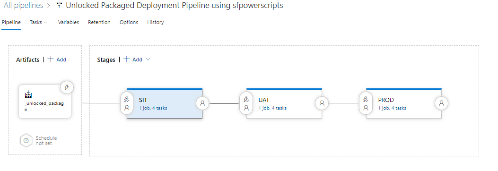
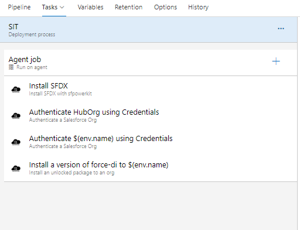

# Release Pipeline - Unlocked Package Based Deployment

Release pipelines are one of the most exciting benefits of using Azure Pipelines, which is not just for Continuous Integration but can also act us an automated release orchestrator. This sample pipeline demonstrates how to orchestrate an installation of an unlocked package across various environments.

This pipeline can be triggered manually by some one releasing a previously build artifact to the the environment or automated. This could be automated using the various mechanisms available in Azure Pipelines

**Pipeline Snapshot**











**Tasks Snapshot in one of the stages**

The steps that are part of the pipeline in an individual stage are

1. [Install SFDX CLI](../task-specifications/utility-tasks/install-sfdx-cli-with-sfpowerkit.md)
2. [Authenticate an Org](../task-specifications/authentication/authenticate-an-org.md) \( In this case, it is authenticating against DevHub\)
3. [Authenticate an Org](../task-specifications/authentication/authenticate-an-org.md) \( In this case, it is authenticating against the Sandbox to be deployed\)
4. [Install a version of the unlocked package to the target environment](../task-specifications/deployment-tasks/install-an-unlocked-package-to-an-org.md)


Please note, we still recommend at this stage to use classic pipelines for Continuous Delivery. YAML Pipelines are missing some elements like Manual Intervention which are essential for modelling Salesforce Deployment


