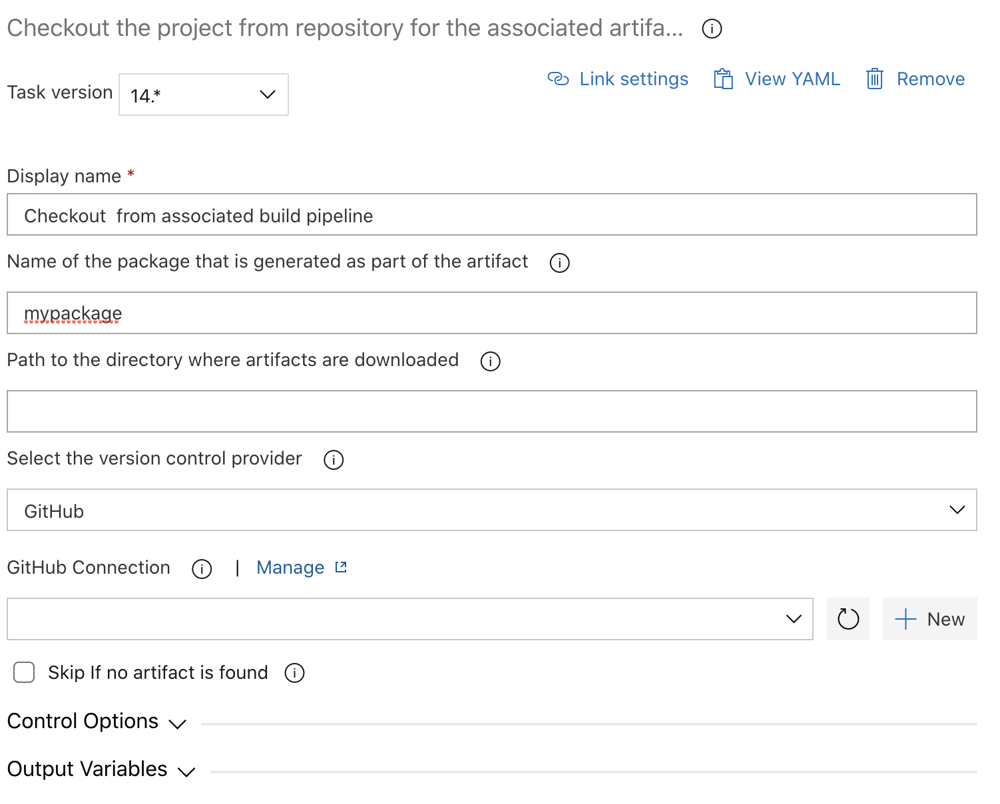
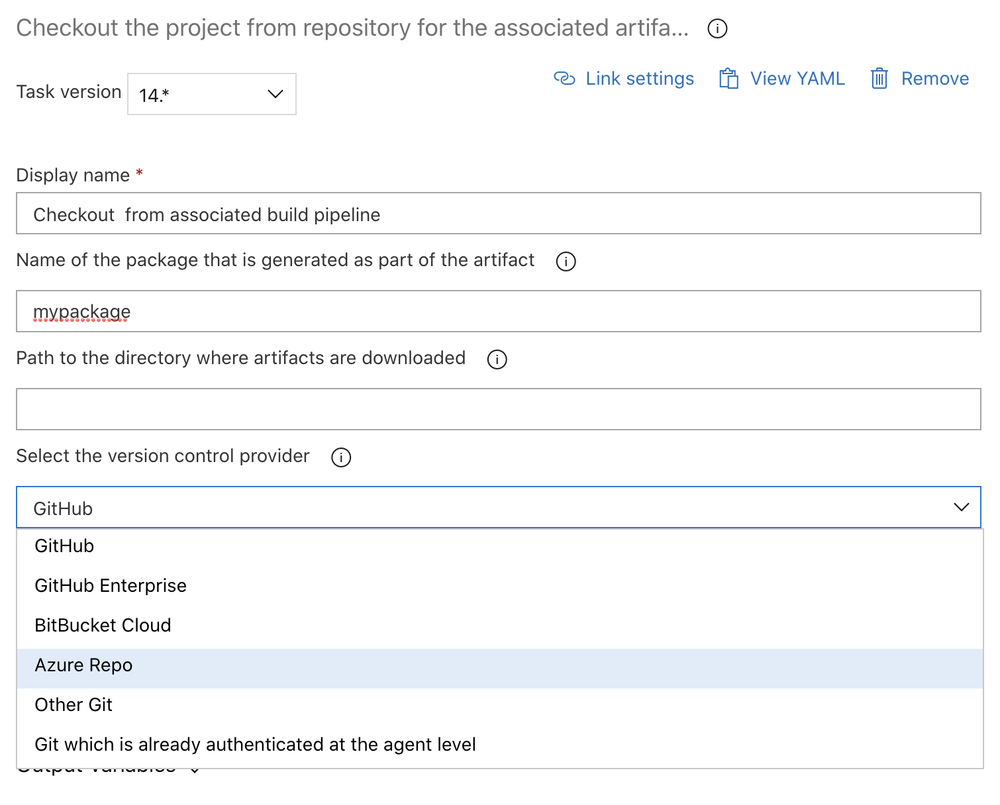

# Checkout the project from repository for the associated artifact

| Task Id | Version |
| :--- | :--- |
| sfpwowerscript-checkoutprojectfromartifact-task | 14.0.5 |

This task is used to checkout the code to a particular commit id from a 'git' repo as specified in the artifact produced by any sfpowerscripts packaging tasks. This task is used in a release pipeline to have access to the code for utilizing [deploying a package \(source format\) to an org](deploy-a-source-repo-to-org.md) task or any other source manipulations. The repo URL and commit id are already specified in the artifact produced by Packaging Tasks. This task at the moment only authenticating a few git providers with HTTPS access. There is also an option for authenticating the agent with a preferred method before using this function \(.. already authenticate at the agent level\)

**Task Snapshot**











## **P**arameters



Classic Designer Labels are in **Bold,** YAML Variables are in _italics_

* **Name of the package that is generated as part of the artifact /** _package_

  Name of the sfdx package that generated this artifact

* **Path to the directory where artifacts are downloaded** / _artifactDir_

  Path to the artifact directory where the artifacts are downloaded, If not provided, the default values will be automatically used.

* **Select the version control provider /** _versionControlProvider_ The version control provider that hosts the particular repository. Select the appropriate repository type from the drop down \(in UI\) or pass the name of the service connection. You can read more on using service connections [here](https://docs.microsoft.com/en-us/azure/devops/pipelines/library/service-endpoints?view=azure-devops&tabs=yaml).

The supported options are

* **Github Connection /** github\_connection  

  Use this if your repository  provider is GitHub  

* **GitHub Enterprise Connection /** _github\_enterprise\_connection_   

  Use this if your repository provider is GitHub Enterprise  

  _\_**- Bitbucket Connection /** \_bitbucket\_connection_  

  _\*\*_Use this if your repository provider is Bitbucket  

  **- Azure Repo /** _azureRepo_  

  _\*\*_Use this if your repository provider is Azure Repo. Please ensure the agent has the right permissions for authenticating to the Azure Repo \( enabled by  '[Allow Scripts to access the OAuth Token'](https://docs.microsoft.com/en-us/azure/devops/pipelines/build/options?view=azure-devops#allow-scripts-to-access-the-oauth-token) \)  

  **- Other Git /** _otherGit_  

  _\*\*_Any other Git provider which can be authenticated using a username/password based basic authentication schema.  

* **Git which is already authenticated at the agent level /** hostedAgentGit  

  Use this option if the agent is already authenticated to Git repository \(typically used in a self hosted agent or if none of the above methods are not suffice to connect to your git repository\)  

* **Skip if no artifact is found** / skip\_on\_missing\_artifact  

  Once enabled, the task will be skipped if the artifact mentioned is not attached to the release pipeline. This option is useful if the artifacts are attached to the release pipeline dynamically



* **sfpowerscripts\_checked\_out\_path** The path to the directory where the source code is checked out


If this task is used in a Task Group, the output parameters would not be available. For subsequent tasks, instead provide the checked out path manually, which follow this format:

$`(System.ArtifactsDirectory)/<artifact_alias>/<name_of_package>/source`




```text
Currently only tested in classic release pipeline
```




When using the option Git which is already authenticate at the agent level, the task will fetch the repository using the URL mentioned in the artifact. Ensure the artifact is produced with the correct URL during the build phase.


**Changelog**

* 14.0.5 Refactor artifact structure [\#131](https://github.com/Accenture/sfpowerscripts/pull/131), remove the need for artifact source alias and artifact type as input parameters [\#151](https://github.com/Accenture/sfpowerscripts/commit/77f05de9411fc7f5d6fa32b68f3628fb6ef7fafa)
* 13.3.4 Update Core dependency
* 13.2.0   -  Added support for git authentication where the agent is already authenticated earlier -   Removed telemetry collection  -  Add support of the task to skipped if there is no artifact for 
* 11.0.5 Refactored to use revamped folder structure
* 10.0.7 Add support for artifacts generated from a mono repo
* 8.0.1 Patch issue with azure Repo
* 8.0.0 Add support for Delta Packaging
* 6.0.0 Uses Service Credentials
* 5.0.1 Updated with Telemetry
* 4.8.0 Minor Improvements
* 2.8.0 Initial Version

