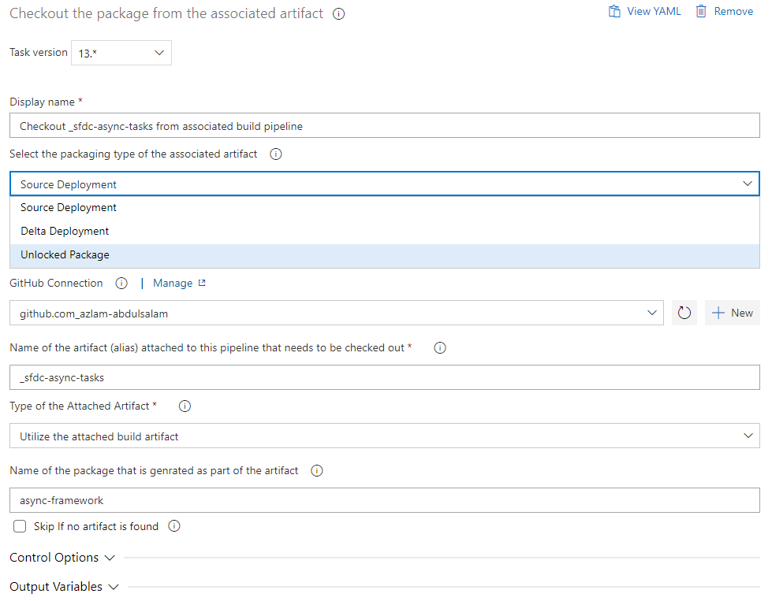
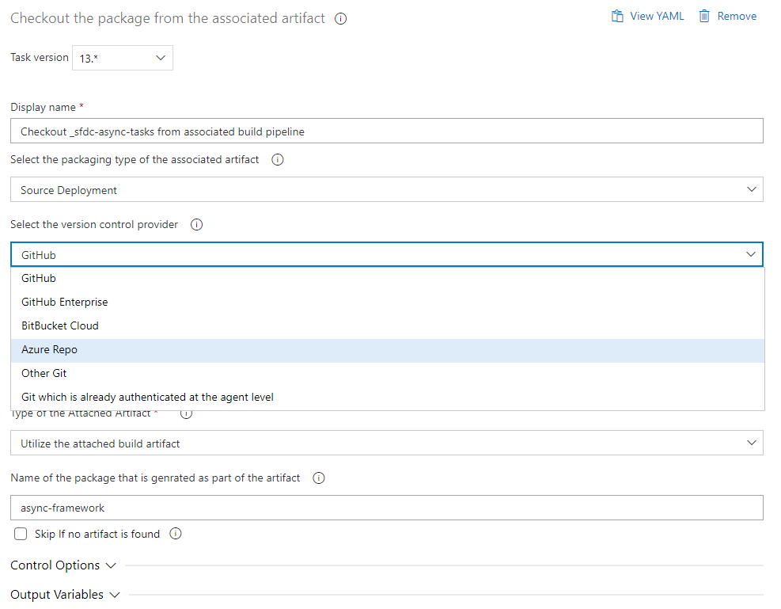

# Checkout the project from repository for the associated artifact

| Task Id | Version |
| :--- | :--- |
| sfpwowerscript-checkoutprojectfromartifact-task | 13.2.0 |

This task is used to checkout the code to a particular commit id from a 'git' repo as specified in the artifact produced by any  sfpowerscripts packaging tasks. This task is used in a release pipeline to have access to the code either for a source deployment or for a pre/post deployment of an unlocked package. The repo URL and commit id are already stored in the artifact produced by Packaging Tasks. This task at the moment only authenticating a few git  providers with HTTPS access. There is also an option for authenticating the agent with a preferred method before using this function \(.. already authenticate at the agent level\)

**Task Snapshot**











#### **P**arameters



Classic Designer Labels are in **Bold,**  YAML Variables are in _italics_

* **Select the packaging type of the associated artifact /** _typeOfArtifact_ ****Select the associated artifact that needs to be checked out from the repository, possible values are Source Package \(source\), Delta Package\(delta\) and Unlocked Package \(unlocked\). This parameter is used to drive the other parameters when configuring in classic mode 
* **Name of the artifact attached to this pipeline that needs to be checked out /** _artifact_ The source alias of the artifact that is attached to this release pipeline.  
* **Name of the package that is generated as part of the artifact /** _package_

  Name of the sfdx package that generated this artifact

 

* **Artifact Provider for the attached artifact /** artifactProvider The provider for the particular artifact that is attached to the pipeline, The task supports these possible values  - **Build Artifact** / _BuildArtifact_ ****: If your artifact is the output of a build pipeline, use this provider -  **Azure Artifact** / _AzureArtifact_: If you are using Azure Artifacts to store your artifacts, use this provider 
* **Select the version control provider /** _versionControlProvider_  
  The version control provider that hosts the particular repository. Select the appropriate repository type from the drop down \(in UI\) or pass the name of the service connection. You can read more on using service connections  [here](https://docs.microsoft.com/en-us/azure/devops/pipelines/library/service-endpoints?view=azure-devops&tabs=yaml).

  
  The supported options are    
  
  -  **Github Connection /** github\_connection  
    Use this if your repository  provider is GitHub  
  -  **GitHub Enterprise Connection /** _github\_enterprise\_connection_   
     Use this if your repository provider is GitHub Enterprise  
  __**- Bitbucket Connection /** _bitbucket\_connection_  
     ****Use this if your repository provider is Bitbucket  
  **- Azure Repo /** _azureRepo_  
   ****Use this if your repository provider is Azure Repo. Please ensure the agent has the right permissions for authenticating to the Azure Repo \( enabled by  '[Allow Scripts to access the OAuth Token'](https://docs.microsoft.com/en-us/azure/devops/pipelines/build/options?view=azure-devops#allow-scripts-to-access-the-oauth-token) \)  
  **- Other Git /** _otherGit_  
   ****Any other Git provider which can be authenticated using a username/password based basic authentication schema.  
  
  - **Git which is already authenticated at the agent level /** hostedAgentGit  
  Use this option if the agent is already authenticated to Git repository \(typically used in a self hosted agent or if none of the above methods are not suffice to connect to your git repository\)  



* **sfpowerscripts\_checked\_out\_path** The path to the directory where the source code is checked out



```text
- task: sfpwowerscript-checkoutprojectfromartifact-task.sfpwowerscript-checkoutprojectfromartifact-task@13
  displayName: 'Checkout _sfdc-async-tasks from repositrory'
  inputs:
    github_connection: 'github.com_my_github_connection'
    artifact: '_sfdc-async-tasks'
    package: 'async-framework'

```




When using the option Git which is already authenticate at the agent level, the task will fetch the repository using the URL mentioned in the artifact. Ensure the artifact is produced with the correct URL during the build phase.


**Changelog**

* 13.2.0   -  Added support for git authentication where the agent is already authenticated earlier -   Removed telemetry collection 
* 11.0.5 Refactored to use revamped folder structure
* 10.0.7 Add support for artifacts generated from a mono repo
* 8.0.1 Patch issue with azure Repo
* 8.0.0 Add support for Delta Packaging
* 6.0.0 Uses Service Credentials
* 5.0.1 Updated with Telemetry
* 4.8.0 Minor Improvements
* 2.8.0 Initial Version

