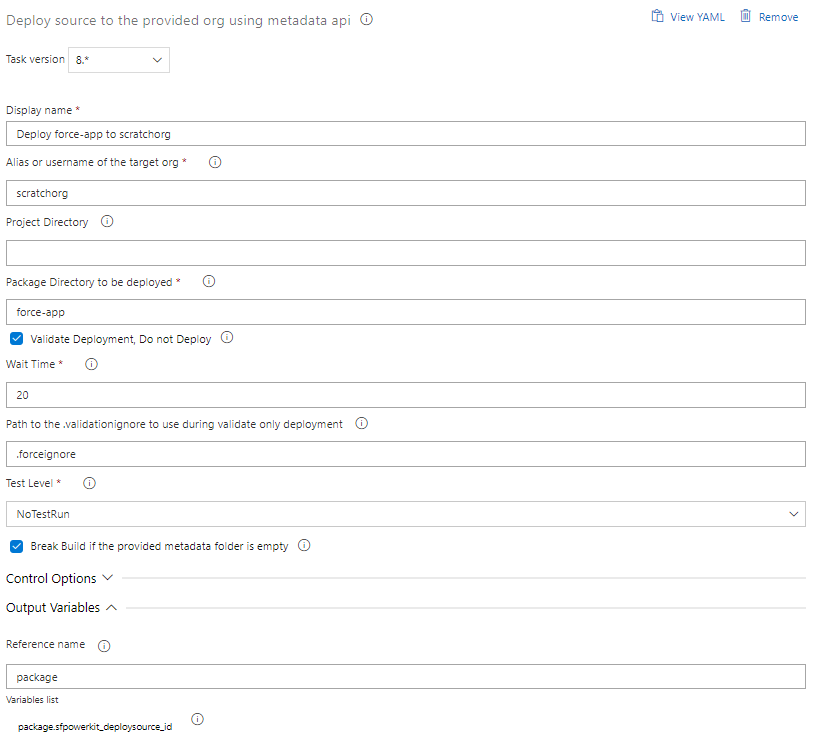
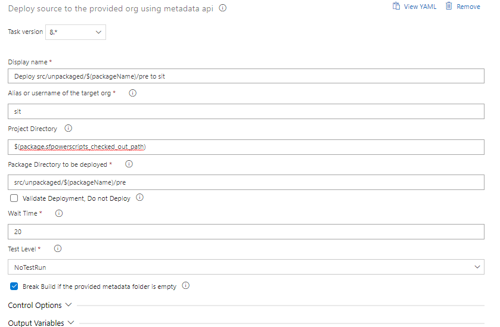

# Deploy a Package \(Source Format\) to an Org

| Task Id | Version |
| :--- | :--- |
| sfpowerscript-deploysourcetoorg-task | 10.0.5 |

This task is used to deploy/validate metadata which is in source format \(newer format\) to any org, be it a scratch org, sandbox or production. The task does the following things.

1. Converts the source directory to metadata using **source:convert** command
2. Use **mdapi:deploy** to deploy/validate the converted metadata to an org
3. Run any associated test runs supported along with the **mdapi:deploy** command

You can read about mdapi:deploy command [here](https://developer.salesforce.com/docs/atlas.en-us.sfdx_cli_reference.meta/sfdx_cli_reference/cli_reference_force_mdapi.htm) and understand the various options

This task is typically used in a Validation Stage, such as [pull request validation pipeline](../../pipelines/pull-request-validation-using-scratch-org.md) or in a release pipelines \( [Org Based](../../pipelines/release-pipeline-org-development.md) / Hybrid deployment models\) where the package directory in a checked out project is deployed to an org.

**Prerequisites**

[Install SFDX CLI with sfpowerkit](../utility-tasks/install-sfdx-cli-with-sfpowerkit.md) task must be added to the pipeline before utilizing this task

**Task Snapshot**











## **P**arameters



Classic Designer Labels are in **Bold,** YAML Variables are in _italics_

* **Alias or username of the target org /** _target\_org_

  Provide the alias or username of the target org on which the source directory is to be deployed

* **Project Directory /** project\_directory

  Leave it blank if the sfdx-project.json is in the root of the repository, else provide the folder directory containing the sfdx-project.json

* **Source/Package directory to be deployed /** _source\_directory_

  The relative path of the source/package directory that needs to be deployed within the Project Directory

* **Validate Deployment, do not deploy /** _checkonly_

  Enable this for doing a [validate only deployment](https://help.salesforce.com/articleView?id=deploy_monitoring.htm&type=5). Utilize this mechanism for Pull Request against Sandbox to validate the metadata or if you prefer a validate deployment before doing a quick deployment.

* **Ignore any warning during a deployment** / _ignorewarnings_ Check this field to ignore warnings, default behaviour results in warnings treated as errors
* **Ignore any errors during a deployment** / _ignoreerror_

  Check this field to ignore any errors during deployment, if enabled failed components will be ignored

* **Path to the .validationignore to use during validate only deployment /** _validation\_ignore_ Only enabled when _checkonly_ is enabled , this is optional field for specifying a path to .validationignore \( a file following the same notions of .forceignore af\) that can be specified to ignore certain metadata during a validate only deployment. This is needed to overcome certain salesforce quirks, where certain metadata is not allowed for a validate only deployment
* **Wait Time /** wait\_time

  Time to wait for this execution to complete,after this set wait time the next task in the pipeline will be executed. It is recommended to provide sufficient wait time so that the command can be made into a synchronous execution

* **Test Level /** _testlevel_

  Select the appropriate test level if test are required to be exectued along with the deployment, Possible values are the following

  * **NoTestRun /** _NoTestRun \*\*_: Do not run any tests
  * **RunSpecifiedTests /** _RunSpecifiedTests \*\*_: Run specified tests mentioned in the following configuration item “Tests to be Executed\(specifed\_tests\)
  * **RunApexTestSuite /** _RunApexTestSuite_: Run an apex test suite \(apextextsuite\)
  * **RunLocalTests /** _RunLocalTests \*\*_: Run all the local tests
  * **RunAllTestsInOrg /** RunAllTestsInOrg: Run all the tests in the org 

* **Tests to be executed /** _specifed\_tests_

  Only visible, if the testlevel is RunSpecifiedTests, Provide a comma seperated values of all the test classes that need to be executed

* **ApexTextSuite /** apextextsuite _\*\*_Only visible, if the test level is RunApexTestSuite, Provide the name of the apex test suite that need to be executed. An apex test suite should be available in the
* **Break Build if the provided metadata folder is empty /** _isToBreakBuildIfEmpty_

  Enable this flag to break the build, if the metadata folder provide is empty, other wise the task will ignore and just move to the next task if encountering an empty metadata folder



* **sfpowerkit\_deploysource\_id** The id for this particular deployment job.







**Changelog**

* 10.0.5 Add ignore warnings and errors input parameters
* 9.0.6 [\#115](https://github.com/Accenture/sfpowerscripts/pull/115) Print metadata to be deployed in console
* 7.1.4 Fix bug related to empty folder check
* 7.0.9 Refactored to use revamped folder structure
* 6.0.6 Support for installation of packages of a build that generate multiple artifacts such as MonoRepo and Bugfixes
* 5.1.0 Break Build if empty metadata is encountered
* 3.0.1 Updated with Telemetry
* 2.8.0 Initial Version

