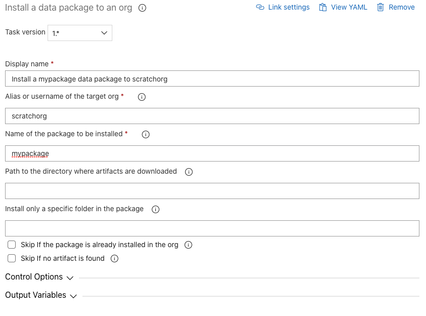

# Install a Data package to an Org

| Task Id | Version |
| :--- | :--- |
| sfpowerscripts-installdatapackage-task | 1.0.27 |

Installs a [Data package](../packaging-tasks/create-a-new-version-of-data-package.md), containing  Salesforce records in CSV format, to an org. 

**Prerequisites**

The SFDX SFDMU plugin is required for this task to work. It can be installed using the [Install SFDX CLI with sfpowerkit](../utility-tasks/install-sfdx-cli-with-sfpowerkit.md) task, by specifying 'Additional plugins to be installed'.

**Task snapshot**



**Parameters**



Classic Designer Labels are in **Bold,**  YAML Variables are in _italics_

* **Alias or username of the target org** / _target\_org_

  Provide the alias or username of the target org  on which the unlocked package is to be deployed

* **Name of the package to be installed** / _package_

  Name of the package to be installed  

* **Path to the directory where artifacts are downloaded** / _artifactDir_

  Provide the path of the directory where the artifacts will be unpacked, By default the task will be picked up in the Pipeline.Workspace \(in case of YAML Pipelines\) or System.ArtifactsDirectory \(in case of Classic Pipelines\).

* **Install only a specific folder in the package** / _subdirectory_

  Installs a specific subdirectory / subpackage within the Data package. Each subdirectory must have its own export.json defined.

* **Skip if the package is already installed in the org** / _skip\_if\_package\_installed_

  Skip installation of the package if it is already installed in the org

* **Skip if no artifact is found** / _skip\_on\_missing\_artifact_

  Once enabled, the task will be skipped if the artifact mentioned is not attached to the release pipeline. This option is useful if the artifacts are attached to the release pipeline dynamically



None



```text
- task: sfpowerscripts-installdatapackage-task@<version>
  displayName: 'Install a mypackage data package to scratchorg'
  inputs:
    package: mypackage
```



**Changelog**

* 1.0.0 - Initial version

