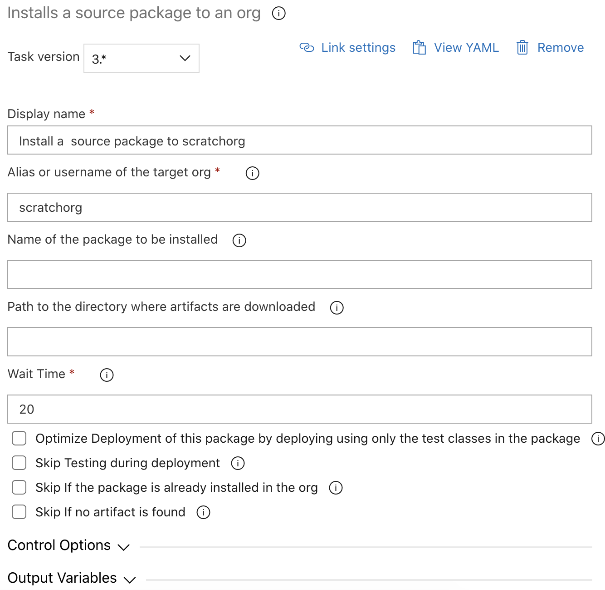

# Install a Source Package to an Org

| Task Id | Version |
| :--- | :--- |
| sfpwowerscript-installsourcepackage-task | 3.0.1 |

This task installs a source package created by [Create a new version of Source based package](https://dxatscale.gitbook.io/sfpowerscripts/azure-pipelines/task-specifications/packaging-tasks/create-source-based-package) into an org using metadata api.

**Prerequisites**

[Install SFDX CLI with sfpowerkit](../utility-tasks/install-sfdx-cli-with-sfpowerkit.md) must be added to the pipeline before utilizing this task

**Task Snapshot**



## Parameters



Classic Designer Labels are in **Bold,** YAML Variables are in _italics_

* **Alias or username of the target org /** _envname_

  Provide the alias or username of the target org on which the unlocked package is to be deployed  

* **Name of the package to be installed /** _package_

  Name of the package to be installed

* **Path to the directory where artifacts are downloaded /** artifactDir : Provide the path of the directory where the artifacts will be unpacked, By default the task will pick up the Pipeline.Workspace \(in case of YAML Pipelines\) or System.ArtifactsDirectory \(in case of Classic Pipelines\).

* **Optimize Deployment of this package by deploying using only the test classes in the package** / optimizeDeployment: Optimizes the speed of the deployment by using only the test classes in the package. This option will only work if all the apex class have more than 75% code coverage ensured by the classes in the package 

* **Skip Testing during deployment** / _skipTesting_

  Only available as an option with sandboxes, for temporary deployments by skipping triggering of tests

* **Wait Time** _/ wait\_time_

  Wait time for the command to finish in minutes

* **Skip if the package is already installed in the org** / _skip\_if\_package\_installed_

  Skip installation of the package if it is already installed in the org

* **Skip if no artifact is found** / skip\_on\_missing\_artifact Once enabled, the task will be skipped if the artifact mentioned is not attached to the release pipeline. This option is useful if the artifacts are attached to the release pipeline dynamically



* sfpowerscripts\_installsourcepackage_\__deployment_\__id



```text
   - task: sfpowerscript-installsourcepackage-task@<version>
    displayName: 'Install a  source package service to $(alias) '
    inputs:
      envname: '$(alias)'
      package: service
      optimizeDeployment: true
      skip_if_package_installed: true
      skip_on_missing_artifact: true
```



\*\*\*\*

**Changelog**

* 3.0.1 - Deprecate 'Install only a specific folder in the package' / _subdirectory_
* 1.0.8 Initial Version

