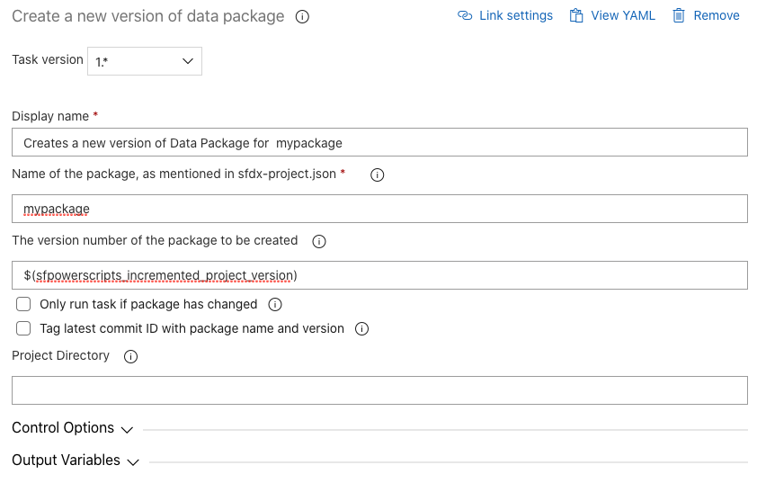

# Create a new version of Data package

| Task ID | Latest version |
| :--- | :--- |
| sfpowerscripts-createdatapackage-task4.0.14 | 2.0.18 |

Create a versioned artifact consisting of Salesforce records in CSV format, generated by the SFDX [SFDMU plugin](https://github.com/forcedotcom/SFDX-Data-Move-Utility). The package can be subsequently installed using the [Install Data Package task](../deployment-tasks/install-a-data-package-to-an-org.md), which uploads the records to a target org.

**Task snapshot**



**Parameters**



Classic Designer Labels are in **Bold,** YAML Variables are in _italics_

* **Name of the package** / _package_

  Provide the name of the package

* **The version number of the package to be created** / _version\_number_

  The format is `major.minor.patch.buildnumber` . This will override the build number mentioned in the `sfdx-project.json`. Consider running the [Increment Version Number task](../utility-tasks/increment-version-number-of-a-package.md) before this task and passing the `sfpowerscripts_incremented_project_version` variable as an input to this field.

* **Only run task if package has changed** / _isDiffCheck_

  Enable this option to conditionally build the Data package only if there has been a change to the package. To determine whether a package has changed, also enable 'Tag latest commit ID with package name and version'.

* **Tag latest commit ID with package name and version** / _isGitTag_

  Enable this option to tag the latest commit ID with an annotated Git tag that shows the package name and version. To push the tag to your repository, please refer to [Execute Post Steps after Creating a Package](execute-post-steps-after-creating-a-package.md).

* **Project Directory** / _project\_directory_

  This parameter may be left blank if the `sfdx-project.json` is in the root of the repository, else provide the folder directory containing the `sfdx-project.json`



* **sfpowerscripts\_package\_version\_number**

  Version number of the package

* **sfpowerscripts\_artifact\_path**

  Path to data package zip artifact



```text
steps:
- task: sfpowerscripts-createdatapackage-task@<version>
  displayName: 'Creates a new version of Data Package for  mypackage'
  inputs:
    package: mypackage
    version_number: '$(sfpowerscripts_incremented_project_version)'
```



**SFDX Project Configuration**

The following properties can be added to the SFDX project configuration.

| Property | Type | Required | Value/s |
| :--- | :--- | :--- | :--- |
| type | String | true | data |
| assignPermSetsPreDeployment | String\[\] | false |  |
| assignPermSetsPostDeployment | String\[\] | false |  |


Properties in the SFDX project configuration are case sensitive.


**Changelog**

* 2.0.18 - Change artifact format to zip file
* 1.0.0 Initial version

