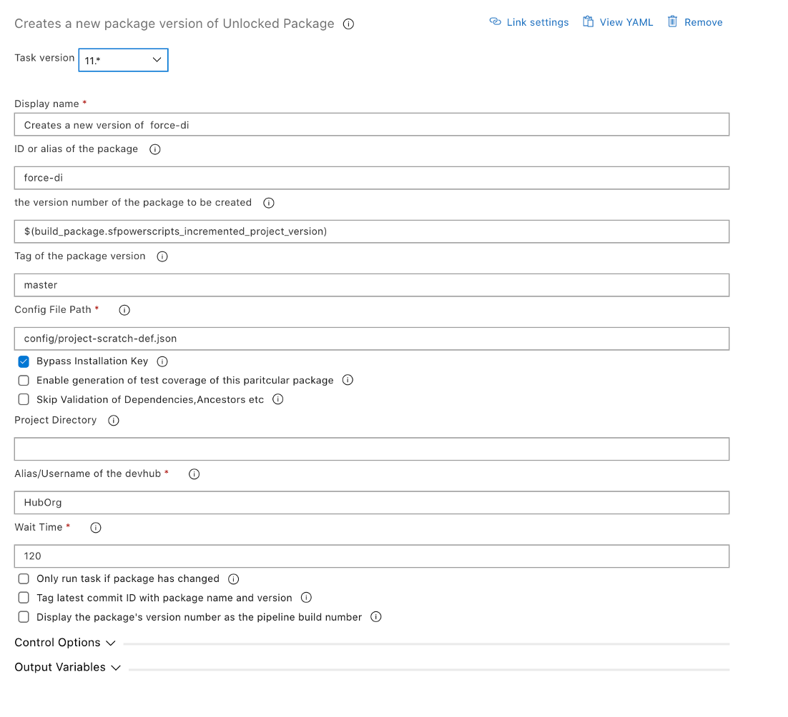

# Create a new version of Unlocked Package

| Task ID | Latest Version |
| :--- | :--- |
| sfpwowerscripts-createunlockedpackage-task | 12.0.5 |

This task is used to create a new version of an Unlocked Package. The task can optionally generate a build artifact, containing metadata such as the package ID, name, version, repository URL and the commit ID from which it was generated. The build artifact can then be used in release pipelines to install the associated unlocked package in a Salesforce org. You can read more about unlocked packages [here](https://developer.salesforce.com/docs/atlas.en-us.sfdx_dev.meta/sfdx_dev/sfdx_dev_dev2gp.htm).

**Prerequisites**

[Install SFDX CLI with sfpowerkit](../utility-tasks/install-sfdx-cli-with-sfpowerkit.md) task must be added to the pipeline before utilizing this task

**Task Snapshot**



## Parameters



Classic Designer Labels are in **Bold,** YAML Variables are in _italics_

* **ID or alias of the package /** _package_

  Provide the alias or username of the target org on which the source directory is to be deployed

* **the version number of the package to be created /** _version\_number_

  The format is `major.minor.patch.buildnumber`. This will override the build number mentioned in the `sfdx-project.json`. Consider using the [Increment Version Number task](../utility-tasks/increment-version-number-of-a-package.md) before this task and passing the`sfpowerscripts_incremented_project_version` variable as an input to this field.

* **Tag of the package version /** _tag_

  The tag of the package version to be created

* **Enable generation of test coverage of this particular package /** _enable\_coverage_

  Calculate and store the code coverage percentage by running the Apex tests included in this package version.

* **Skip Validation of Dependencies,Ancestors etc /** _isValidationToBeSkipped_

  Skips validation of dependencies, package ancestors, and metadata during package version creation. Skipping validation reduces the time it takes to create a new package version, but package versions created without validation can’t be promoted.

* **Config File Path /** _config\_file\_path_

  Path in the current project directory containing config file for the packaging org

* **Bypass Installation Key /** _installationkeybypass_

  Bypass the requirement for having an installation key for this version of the package.

* **Installation Key /** _installationkey_

  Installation key for this package

* **Project directory /** _project\_directory_

  Leave it blank if the `sfdx-project.json` is in the root of the repository, else provide the folder directory containing the `sfdx-project.json`.

* **Alias/username of the Dev Hub**

  Provide the alias of the Dev Hub previously authenticated, default value is `HubOrg` if using the [Authenticate Devhub task](../authentication/).

* **Wait Time /** _wait\_time_

  Time to wait for this execution to complete,after this set wait time the next task in the pipeline will be executed. It is recommended to provide sufficient wait time so that the command can be made into a synchronous execution

* **Only run task if package has changed /** _isDiffCheck_

  Enable this option to conditionally build the source package only if there has been a change to the package. To determine whether a package has changed, also enable 'Tag latest commit ID with package name and version'.

* **Tag latest commit ID with package name and version** / _isGitTag_

  Enable this option to tag the latest commit ID with an annotated Git tag that shows the package name and version. To push the tag to your repository, please refer to [Execute Post Steps after Creating a Package](execute-post-steps-after-creating-a-package.md).

* **Display the package's version number as the pipeline build number** / _set\_build\_number_

  Set the pipeline's build number to the the package's incremented version number. Useful when one is using NEXT as the build number.



**sfpowerscripts\_package\_version\_id**

This variable holds the id of the package version. Use this package version to install it or use it for any other subsequent tasks.

**sfpowerscripts\_package\_version\_number**

The version number of the package that was created



```text
steps:
- task: sfpwowerscripts-createunlockedpackage-task@11
  displayName: 'Creates a new version of  <mypackage>'
  inputs:
    package: <mypackage>
    enable_coverage: false
    isValidationToBeSkipped: true
    isDiffCheck: false
    isGitTag: false
```




Please ensure a package is already created before utilizing this task and the package alias is available in the sfdx-project.json, as this task is all about creating a new version of the package


**Changelog**

* 12.0.5 Refactor artifact structure [\#131](https://github.com/Accenture/sfpowerscripts/pull/131), resolve package dependencies to exact version [\#155](https://github.com/Accenture/sfpowerscripts/pull/155)
* 11.0.6 Update Core dependency
* 8.0.9 Refactored to use revamped folder structure
* 7.0.2 Support for creation of multiple packages in a single build such as in a MonoRepo
* 6.0.1 Skip Validation
* 5.1.2 Hotfix for Exception bug
* 5.0.1 Updated with Telemetry
* 4.0.0 Added Coverage Option
* 3.1.0 Initial Version

