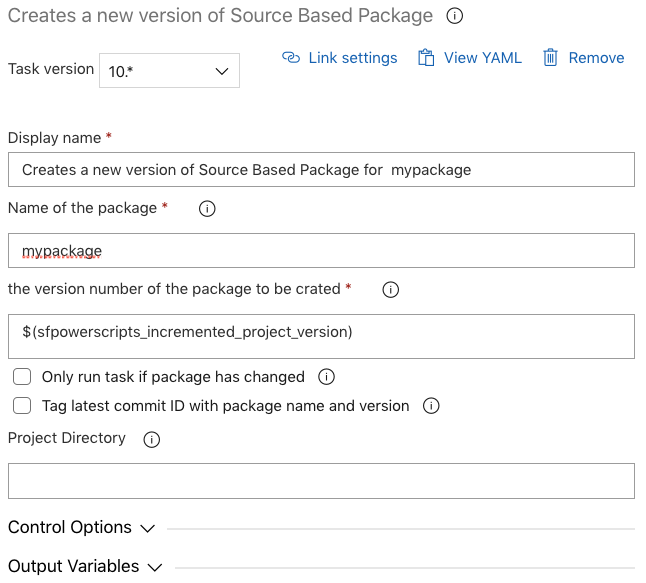

# Creates a new  version of  Source Based Package

| Task ID | Latest version |
| :--- | :--- |
| sfpwowerscripts-createsourcepackage-task | 12.0.6 |

At present, Salesforce unlocked package doesn't support packaging of all metadata types, also some metadata are not meant to be deployed using unlocked package \(such as org specific entities\). However to deploy such metadata across multiple org's, one has to resort to deploying metadata directly from a source repo using 'metadata api'. Source based packages is a 'sfpowerscripts' construct that allows one to have the primary advantage of packaging \(mainly traceability, and cohesiveness\) to non packaging supported metadata components.


If you are not yet ready with unlocked packages, however would like to get started into the world of package based development, source package will be your primary starting point.


This task generates a build artifact which include the source \(metadata\) which will be deployed using the Install Source Package Task.


Source Packages are only traceable from an azure pipelines perspective. On your Salesforce org, it will be treated a normal metadata deployment.



Source Packages like any other metadata deployment requires a unit test coverage of 75% for each classes that is part of the deployment. We recommend you ensure that your package have all the necessary test classes with sufficient coverage for optimal performance. In case it is not possible, switch the flag to 'Deploy via triggering all local tests in the org' in the Install Source Package Task.

Please note this can considerably delay deployments considering how the test classes are written in the org


**Task Snapshot**



## Parameters



Classic Designer Labels are in **Bold,** YAML Variables are in _italics_

* **Name of the package /** _package_ _\*\*_Provide the name of the package.
* **The version number of the package to be created” /** _version\_number_ The format is `major.minor.patch.buildnumber` . This will override the build number mentioned in the `sfdx-project.json`. Consider running the [Increment Version Number task](../utility-tasks/increment-version-number-of-a-package.md) before this task and passing the `sfpowerscripts_incremented_project_version` variable as an input to this field.
* **Only run task if package has changed /** _isDiffCheck_  
  Enable this option to conditionally build the source package only if there has been a change to the package. To determine whether a package has changed, also enable 'Tag latest commit ID with package name and version'.

  \*\*\*\*

* **Tag latest commit ID with package name and version /** _isGitTag_  
  Enable this option to tag the latest commit ID with an annotated Git tag that shows the package name and version. To push the tag to your repository, please refer to [Execute Post Steps after Creating a Package](execute-post-steps-after-creating-a-package.md).

  \*\*\*\*

* **Project Directory /** _project\_directory_ This parameter may be left blank if the `sfdx-project.json` is in the root of the repository, else provide the folder directory containing the `sfdx-project.json` .



**sfpowerscripts\_package\_version\_number**

The version number of the package that was created**.**



```text
steps:
- task: sfpwowerscripts-createsourcepackage-task@<version>
  displayName: 'Creates a new version of Source Based Package for <mypackage>'
  inputs:
    package: <mypackage>
    version_number: <'$(sfpowerscripts_incremented_project_version)'>
    isDiffCheck: false
    isGitTag: false
    project_directory: [dir]
```



**SFDX Project Configuration**

The following properties can be added to the SFDX project configuration.

| Property | Type | Value/s | Required |
| :--- | :--- | :--- | :--- |
| preDeploymentSteps | String | reconcile | false |

_preDeploymentSteps_

| Value | Description |
| :--- | :--- |
| reconcile | Reconcile profiles with the target org before installing the source package. |


Properties defined in the SFDX project configuration are case sensitive.


**Changelog**

* 12.0.6 Refactor artifact structure [\#131](https://github.com/Accenture/sfpowerscripts/pull/131),

  Automatically identify test classes and include in artifact metadata [\#160](https://github.com/Accenture/sfpowerscripts/pull/160)

* 10.0.6 Update Core dependency
* 10.0.1 
  * Removed Telemetry Collection
  * Added Options to tag a package
  * Added Options only to create a package if there is only change
* 7.0.5 Refactored to use revamped folder structure
* 6.0.0 Support for creation of multiple packages in a single build such as in a MonoRepo
* 5.1.0 Minor changes in artifact that is getting stored
* 5.0.1 Updated with Telemetry
* 4.0.0 Initial Version

