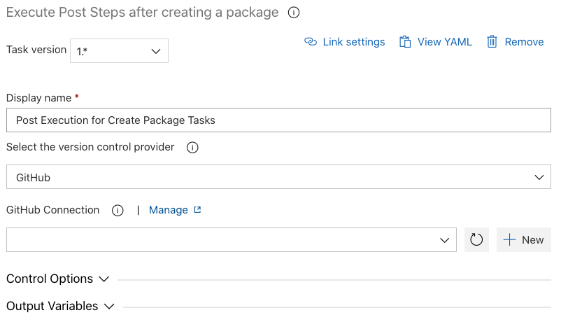

# Execute Post Steps after Creating a Package

| Task ID | Latest Version |
| :--- | :--- |
| sfpowerscripts-postcreatepackage-task | 1.0.12 |

This task is typically appended to the end of a pipeline if tagging is enabled in the Create Source or Unlocked Package tasks. The Execute Post Steps task will persist the Git tag by pushing it to the source code repository. A reminder to add this task to the pipeline is provided if a Create Package command exists in the pipeline with the tagging option enabled.

**Task Snapshot**



## Parameters



Classic Designer Labels are in **Bold,** YAML Variables are in _italics_

**Select the version control provider /** _versionControlProvider_

* The version control provider that hosts the particular repository. Select the appropriate repository type from the drop down \(in UI\) or pass the name of the service connection. You can read more on using service connections  [here](https://docs.microsoft.com/en-us/azure/devops/pipelines/library/service-endpoints?view=azure-devops&tabs=yaml).

The supported options are

* **Github Connection /** github\_connection  

  Use this if your repository  provider is GitHub  

* **GitHub Enterprise Connection /** _github\_enterprise\_connection_  
  Use this if your repository provider is GitHub Enterprise  
  _\_**- Bitbucket Connection /** \_bitbucket\_connection_  
  **\*\*Use this if your repository provider is Bitbucket**    
  - Azure Repo /\*\* _azureRepo_

  Use this if your repository provider is Azure Repo. Please ensure the agent has the right permissions for authenticating to the Azure Repo \( enabled by '[Allow Scripts to access the OAuth Token'](https://docs.microsoft.com/en-us/azure/devops/pipelines/build/options?view=azure-devops#allow-scripts-to-access-the-oauth-token) \)  
  **- Other Git /** _otherGit_  
  _\*\*_Any other Git provider which can be authenticated using a username/password based basic authentication schema.

* **Git which is already authenticated at the agent level /** hostedAgentGit  

  Use this option if the agent is already authenticated to Git repository \(typically used in a self hosted agent or if none of the above methods are not suffice to connect to your git repository\)



None



```text
steps:
- task: sfpowerscripts-postcreatepackage-task@1
  displayName: 'Post Execution for Create Package Tasks'
  inputs:
    github_connection: 'GitHub connection 1'
```




When using the option Git which is already authenticate at the agent level, the task will push to the repository using the URL mentioned in the artifact. Ensure the artifact is produced with the correct URL during the build phase.


**Changelog**

* 1.0.6 Update Core dependency
* 1.0.1 Initial Version

