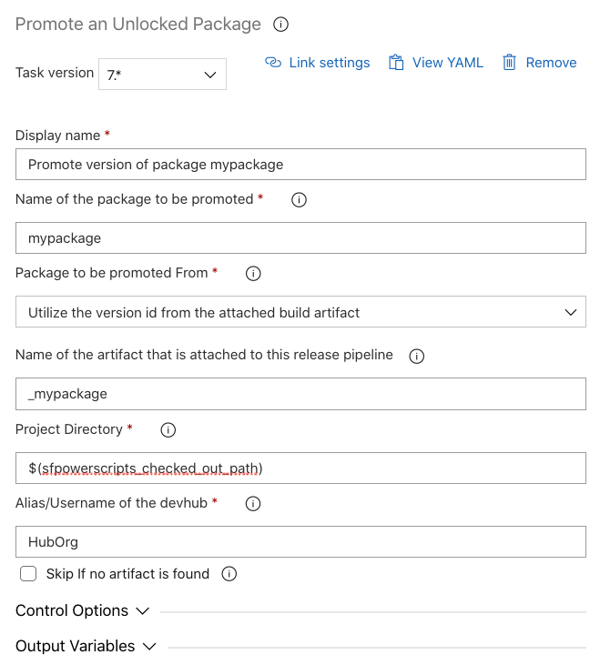

# Promote an Unlocked Package

| Task ID | Latest Version |
| :--- | :--- |
| sfpwowerscript-promoteunlocked-task | 7.0.4 |

This task is used to promote an unlocked package to ‘released’ state before deploying it into a production org. You can read more about promoting a package to released status [here](https://developer.salesforce.com/docs/atlas.en-us.sfdx_dev.meta/sfdx_dev/sfdx_dev_dev2gp_create_pkg_ver_promote.htm). It is recommended to utilize this taks in the ‘Prod’ stage in a release pipeline in most normal scenarios, where a tested package in the lower environment is ready to be deployed to production and the version number has to be frozen.

**Prerequisites**

[Install SFDX with Sfpowerkit](../utility-tasks/install-sfdx-cli-with-sfpowerkit.md) task must be added to the pipeline before utilizing this task.

**Task Snapshot**



#### Parameters



* **Name of the package to be promoted /** _package_

  The name of the package that is to be promoted to the released state. This name does not have any significant value addition other than being just displayed in the task execution.

* **Package to be promoted from /** _packagepromotedfrom_

  This task has three options, ‘**BuildArtifact/** _****BuildArtifact_,’ '**AzureArtifact** / _AzureArtifact_' or ‘**Custom/**_Custom_ ****’.   
  Choose BuildArtifact if the package artifact was created as part of an Azure Build pipeline, and provide the name of the artifact. The AzureArtifact option is intended for attached artifacts from the Azure Artifacts registry \(e.g. Universal packages\); it also requires the name of the artifact to be passed. Finally, the Custom option allows the package version ID to be passed in as an identifier for the package to be promoted.

* **Package Version ID** / _package\_version\_id_

  When the 'Custom' option is selected for the 'package to be promoted from' field, provide the package version ID of the package to be promoted. 

* **Name of the artifact that is attached to this release pipeline** / _artifact_

  Provide the name of the attached artifact \(Build Artifact or Azure Artifact\).

* **Project directory** / _project\_directory_

  The directory containing the `sfdx-project.json.`  

* **Alias/username of the DevHub /** _devhub\_alias_

  Provide the alias of the Dev Hub previously authenticated, default value is `HubOrg` if using the [Authenticate Org task](../authentication/).

* **Skip if no artifact is found /** _skip\_on\_missing\_artifact_

  Enable this option to remove attached artifacts for a specific release, without having to remove the corresponding task from the release pipeline.



None



```text
steps:
- task: sfpwowerscript-promoteunlockedpackage-task@7
  displayName: 'Promote version of package <mypackage> '
  inputs:
    package: <mypackage>
    artifact: '_mypackage'
    project_directory: '$(sfpowerscripts_checked_out_path)'
    skip_on_missing_artifact: false
```




Please note for this task to succeeded, the task needs access to the project directory. If you are using this task in the release pipeline, ensure the project directory is available.


**Changelog**

* 7.0.4 Update Core dependency
* 7.0.0 
  * Removed Telemetry Collection
  * Add support for Azure Artifacts
* 4.0.1 Fix for \#18 Promote task failing to promote unlocked package
* 3.0.9 Refactored to use revamped folder structure
* 2.0.1 Updated with Telemetry
* 1.6.0 Initial Version

