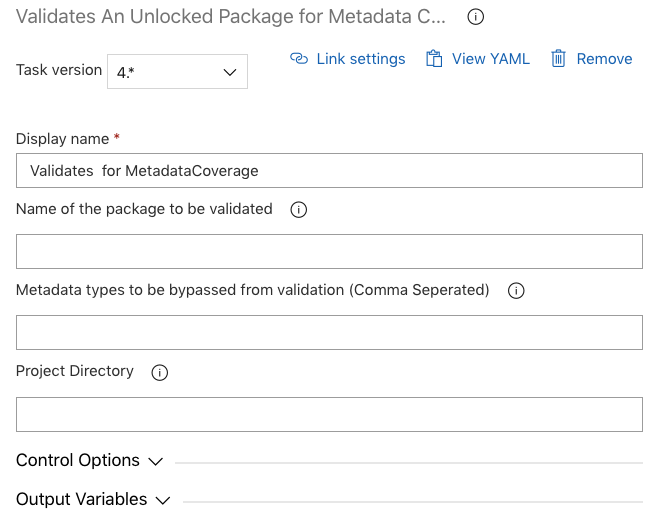

# Validate Unlocked Package for Metadata Coverage

| Task ID | Latest version |
| :--- | :--- |
| sfpwowerscript-validatedxunlockedpackage-task | 4.0.4 |

This task is used to validate the metadata coverage of components that are part of the unlocked package you are building. Typically there are components in normal development that are not covered by unlocked packaging such as settings. Having this metadata in your project directory results either these metadata to be skipped or results in an error during the time of packaging. This task checks whether the source directory has any such issues.

**Prerequisites**

Please ensure [Install SFDX with Sfpowerkit](../utility-tasks/install-sfdx-cli-with-sfpowerkit.md) task is added to the pipeline before utilizing this task



### Parameters



**Name of the package to be validated /** _package_

The name of the package to be validated_._ If left empty, all of the packages in the project configuration will be validated.

**Metadata types to be bypassed from validation /** _bypass_

Comma-separated list of metadata types to be excluded from metadata coverage validation

**Project Directory** _**/**_  ****_working\_directory_

The project directory, containing the sfdx-project.json.

**Send Anonymous Usage Telemetry /** _isTelemetryEnabled_

Enable this flag to send anonymous usage telemetry to track usage and help bring further improvements to this task.

_\*\*Input fields for YAML format pipelines are italicised_



None



```text
steps:
- task: sfpwowerscript-validatedxunlockedpackage-task@<version>
  displayName: Validates [package] for MetadataCoverage
  inputs:
    package: [name]
    bypass: [metadata type]
    working_directory: [dir]
    isTelemetryEnabled: true
```



**Control Options**

**Gotcha’s**

**Changelog**

* 3.0.9 Refactored to use revamped folder structure
* 2.0.1 Updated with Telemetry
* 1.0.0 Updated for inclusion of bypass option from sfpowerkit

