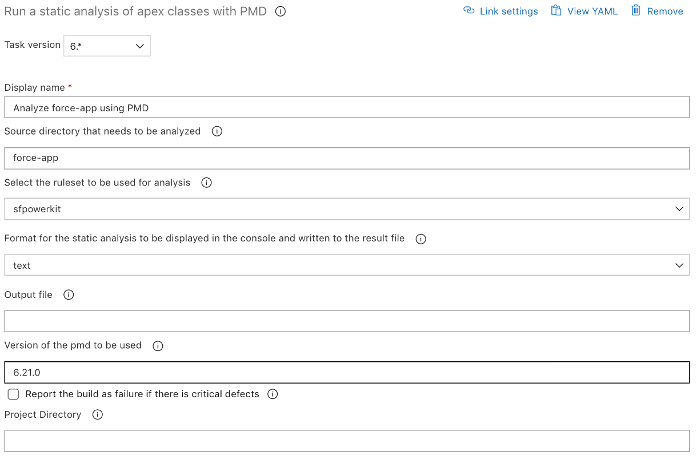

# Run a static analysis of apex classes with PMD

| Task Id | Version |
| :--- | :--- |
| sfpwowerscripts-analyzewithpmd-task | 6.0.4 |

This task is used to run a static analyis of the apex classes in a project directory using PMD. This is a task execution wrapper around the command sfpowerkit:source:pmd which you can read [here](https://github.com/Accenture/sfpowerkit)

This task attaches the code analysis result into the build artifacts and also provides a timeline update in the build summary page. Please note this enahancement only works with ‘Classic’ pipelines only

This task when used in a build pipeline features a report window that gets displayed along with the logs. 

**Prerequisites**

[Install SFDX with Sfpowerkit ](../utility-tasks/install-sfdx-cli-with-sfpowerkit.md) task is added to the pipeline before utilizing this task

**Task Snapshot**



**Parameters**



Classic Designer Labels are in **Bold,**  YAML Variables are in _italics_

* **Source directory that needs to be analyzed /** _directory_ The directory to be analyzed.  **Note:** If left blank, the default directory from sfdx-project.json will be used  
* **Select the ruleset to be used for analysis** / _ruleset_ sfpowerkit comes with a default ruleset. Select custom if you want to use your own ruleset 
* **Path to ruleset** / _rulesetpath_ Specify the ruleset path for PMD if using the custom option  
* **Format for the static analysis to be displayed in the console and written to the result file** / _format_ Select the format for the code analysis report to be generated **NOTE:** All options as of PMD 6.18.0 are supported 
* **Output file** / _outputPath T_he name or path to the file if you want the report to be saved to a particular location,  **Notes:** 
  * leaving this blank will result in using the default options as of sfpowerkit
  * the result of PMD analysis will also be uploaded into the build artifacts 
* **Report the build as failure if there is critical defects** / _isToBreakBuild_ Select this option if you want the build to be failed if PMD observes any critical defects in the code being analyzed 
* **Project Directory** / _project\_directory_ The directory to the folder containing the sfdx-project.json file **Note:** Leave this blank if the sfdx-project.json file is in the root of the repository 
* **Send Anonymous Usage Telemetry /** _isTelemetryEnabled_

  Enable this flag to send anonymous usage telemetry to track usage and bring further improvements to this task



None



None



```text
      - task: sfpwowerscripts-analyzewithpmd-task@4
        displayName: PMD Static Code Coverage
        inputs:
          ruleset: Custom
          rulesetpath: '$(Parameters.rulesetpath)'
          format: html
```



**Changelog**

* 5.0.9 Refactored to use revamped folder structure
* 4.3.10 Minor Fixes for buffer size
* 4.3.0 Updated with minor changes for the data to be displayed in PMD Analysis Tab
* 4.0.1 Updated with Telemetry
* 3.1.0 Initial Version

