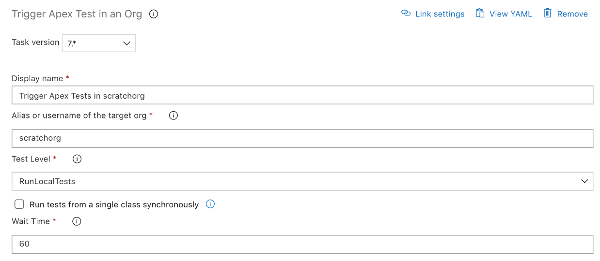

# Trigger Apex Test

| **Task Id** | Version |
| :--- | :--- |
| sfpwowerscript-triggerapextest-task | 9.0.3 |

This task is used to trigger Apex unit tests, and also captures the results as an artifact and publishes the result in the "tests" tab. Supports "RunAllTestsInPackage" test level, which gives option to validate the code coverage of individual classes in the package.

**Prerequisites**

[Install SFDX CLI with sfpowerkit](../utility-tasks/install-sfdx-cli-with-sfpowerkit.md) task must be added to the pipeline before utilizing this task

**Task Snapshot**





Classic Designer Labels are in **Bold,** YAML Variables are in _italics_

* **Alias or username of the target org** / _targetOrg_ The alias or username of the target org 
* **Test Level** / _testlevel_  
  Select the testlevel for this task for the list of possible values:

  * **Run only specified tests /** \_RunSpecifiedTests   

    -  _**Run an apex test suite** / \_RunApexTestSuite_  

  * **Run Local Tests** / _RunLocalTests_  
  * **Run All Tests in the org** / _RunAllTestsInOrg_      

    _-  \*\*_**Run All Tests in package** / _RunAllTestsInPackage_

  \_\_

* **Tests to be executed** / _specified\_tests_ A list of apex test classes to be executed, separated by a comma


This field is only visible/valid if the Test Level is "RunSpecifiedTests"


* **Package Name /** _package_

  Specify name of package to run tests for


This field is only visible/valid if the Test Level is "RunAllTestsInPackage"


* **Apex Test Suite** / _apextestsuite_ The name of the apex test suite to be executed


This field is only visible/valid if the Test Level is "RunApexTestSuite"


* **Run tests from a single class synchronously /** _synchronous_

  _Run tests synchronously_

  \_\_

* **Validate code coverage of individual classes** / _isValidateCoverage_

  Verifies whether individual classes meet the minimum code coverage requirement


This field is only visible/valid if the Test Level is "RunAllTestsInPackage"


* **Minimum percentage coverage required per class** / _coverageThreshold_

  Minimum coverage required per class, in order for the task to succeed


This field is only visible/valid if "isValidateCoverage"


* **Project directory /** _project\_directory_

  The project directory should contain a sfdx-project.json

* **Wait Time** / _wait\_time_ The time this task should wait for the result to be generated.



None



```text
- task: sfpwowerscript-triggerapextest-task@<version>
            displayName: Trigger Apex Test Task
            inputs:
             target_org: 'scratchorg'
             testlevel: 'RunLocalTests'
             wait_time: '60'
             isTelemetryEnabled: true
```



**Changelog**

* 9.0.3 Add RunAllTestsInPackage test level [\#159](https://github.com/Accenture/sfpowerscripts/pull/159)
* 8.0.2 Validate code coverage of individual classes for Apex test suite
* 6.0.4 Refactored to use revamped folder structure
* 4.0.6 Integration of Error Logs with Github
* 3.2.0 Fixes for Post Trigger Test Task
* 3.0.18 Bugfix for stdout buffer running out
* 3.0.17 Updated with artifact upload and submitting test results in the test tab
* 2.0.1 Updated with telemetry
* 1.1.0 Initial Version

