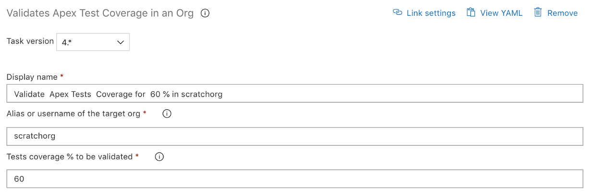

# Validate Apex Test Coverage

| Task Id | Version |
| :--- | :--- |
| sfpwowerscript-validateapextestcoverage-task | 4.0.14 |

This task is used to validate the apex test coverage of an org

**Prerequisites**

[Install SFDX CLI with sfpowerkit](../utility-tasks/install-sfdx-cli-with-sfpowerkit.md) task must be added to the pipeline before utilizing this task

**Task Snapshot**



**Parameters**



Classic Designer Labels are in **Bold,** YAML Variables are in _italics_

* **Alias or username of the target org** / _targetOrg_ The alias or username of the target org



None



```text
          - task: sfpwowerscript-validateapextestcoverage-task@<version>
            displayName: Validate Apex Test Coverage
            inputs:
                target_org: 'scratchorg'
                test_coverage: '60'
```



**Changelog**

* 4.0.8 Update Core dependency
* 4.0.5  Remove Telemetry Collection
* 3.0.9 Refactored to use revamped folder structure
* 2.0.1 Updated with telemetry
* 1.0.0 Initial Version

