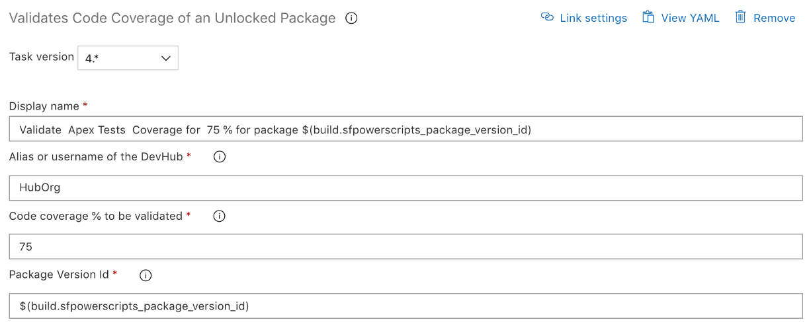

# Validate Code Coverage of a Package

| Task Id | Version |
| :--- | :--- |
| sfpwowerscript-validatetestcoveragepackage-task | 4.0.15 |

This task is used to validate the code coverage of a second generation package.

**Prerequisites**

[Install SFDX CLI with sfpowerkit](../utility-tasks/install-sfdx-cli-with-sfpowerkit.md) task must be added to the pipeline before utilizing this task

**Task Snapshot**

**Parameters**



Classic Designer Labels are in **Bold,** YAML Variables are in _italics_

* **Alias or username of the DevHub** / _target\_org_ The alias or username of the target org 
* **Code coverage % to be validated**  / _test\_coverage_ The percentage of the code coverage that should be validated 
* **Package Version Id** / _package\_version\_id_ The version of the package which should be validated for code coverage   



None








If you are using this task after 'Create Unlocked Package', utilize the output variable to reference the package version id


**Changelog**

* 4.0.9 Update Core dependency
* 4.0.5
  * Remove Telemetry Collection
  * Updated with to match latest version of sfpowerscripts
* 3.0.9 Refactored to use revamped folder structure
* 2.0.1 Updated with telemetry
* 1.0.0 Initial Version

