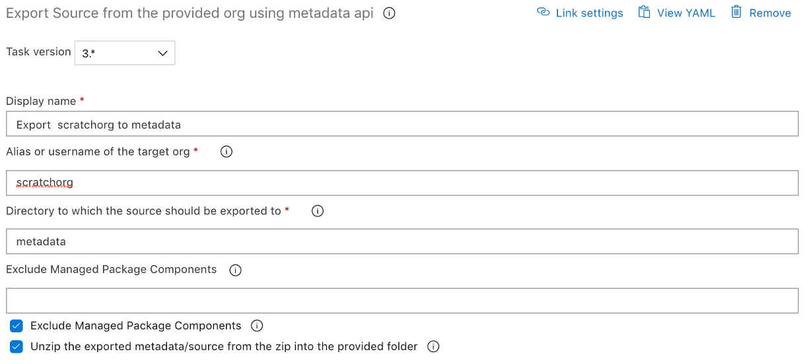

# Export Metadata from an org

| Task Id | Version |
| :--- | :--- |
| sfpowerscript-exportsourcefromorg-task | 3.0.14 |

This task is used to export the complete metadata \(in source format\) from a given org. This task is helpful for daily backups or further analysis of metadata

**Prerequisites**

[Install SFDX CLI with sfpowerkit](install-sfdx-cli-with-sfpowerkit.md) task must be added to the pipeline before utilizing this task

**Task Snapshot**

**Parameters**



Classic Designer Labels are in **Bold,** YAML Variables are in _italics_

* **Alias or username of the target\_org**  The alias or username of the target org  on which the source directory is to be deployed 
* **Directory to which the source should be exported** The path to the directory, where the metadata from the org should be exported. The path will be created if it doesn't exist.  **Note:** The export from the org is in a zip format, Check the ‘Unzip the exported metadata/source from the zip into the provided folder’ 
* **Metadata that needs to be excluded while exporting from the org**  Any metadata types separated by comma, that need to be excluded while exporting. Useful to exclude types such as Connected App, Named Credential etc. 
* **Exclude managed package components** Check this option to exclude managed package metadata components to be exported from the target org 
* **Unzip the exported metadata/source from the zip into the provided folder** The exported metadata is in a zip format. Check this option to unzip the zipped extract from the org to the provided directory



sfpowerscripts\_exportedsource\_zip\_path



None







**Changelog**

* 3.0.8 Update Core dependency
* 3.0.4 Remove telemetry collection
* 2.0.9 Refactored to use revamped folder structure
* 1.0.2 Initial Version

