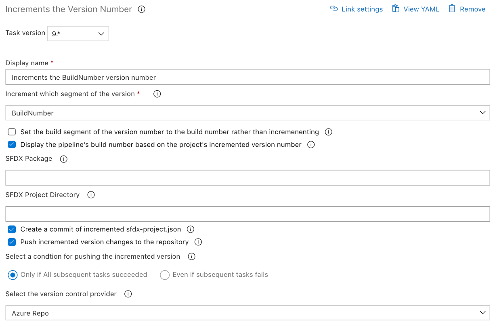

# Increment Version Number of a package

| Task Id | Version |
| :--- | :--- |
| sfpwowerscript-incrementversionnumber-task | 9.0.14 |

This task is used to increment the version number of the package version provided in sfdx-project.json for either an unlocked package or an org based deployment.

Use the version number generated by this task as input to the Create Package tasks, if you want the package number to be incremented during every package build

**Prerequisites**

[Install SFDX CLI with sfpowerkit](install-sfdx-cli-with-sfpowerkit.md) task must be added to the pipeline before utilizing this task

**Task Snapshot**



**Parameters**



Classic Designer Labels are in **Bold,** YAML Variables are in _italics_

* **Increment which segment of the version** / _segment_ Select the segment of the version number that needs to be incremented _**Possible Values:**_ BuildNumber, Patch, Minor, Major 
* **Set the build segment of the version number to the build number rather than incrementing /** _appendBuildNumber_ Check this flag to append the build number rather than incrementing it 
* **Set the pipeline's build number to the project' incremented version number /** _set\_build\_number_ Check this flag if the build pipeline's build number is to be updated with the incremented version  
* **Name of the package** _/ package_ The name of the package on which the version will be created **Note:** If left blank the default package in sfdx-project.json is used  
* **SFDX project directory that needs to be deployed** / _project\_directory_

  The path to the folder directory containing the sfdx-project.json file.  
  _**Note:**_ Leave blank if the sfdx-project.json is in the root of the repository

* **Create a commit of incremented sfdx-project.json** / _commit\_changes_ Check this flag if the incremented version in sfdx-project.json needs to be committed back to the repo **Note:** This commits but does not push the changes
* **Push incremented version changes to the repository** / _pushchanges_ Check this flag to push the incremented version back to the repository.  **Note:** This only supports HTTPS based repository that have a PAT based authentication mechanism. Service Credential based authentication is supported for Github, Github Enterprise and Bitbucket Cloud

The below inputs are enabled only when the "Push Incremented Version changes to the repository" is enabled.

* **Select a condition for pushing the incremented version /** _pushoption_

  Select the approprate condition for the version increment to be pushed to repostory. The options are:

  * “Only if All subsequent tasks succeeded” \(onSucces\), will only pushes changes if all subsequent tasks are successful 
  * “Even if subsequent tasks fails” \(onFailure\), will push to the repository even when subsequent tasks fail 

* **Select the version control provider /** _versionControlProvider_ The version control provider that hosts the particular repo. Available options:
  * **GitHub** _**/** githubEnterprise_
  * **BitBucket Cloud** / _bitbucket_
  * **Azure Repo** / azureRepo
  * **Other Git** / _otherGit_  
* **GitHub Connection /** _github\_connection_ Select the GitHub Service Connection Instructions for using Service Connections: [https://docs.microsoft.com/en-us/azure/devops/pipelines/library/service-endpoints?view=azure-devops&tabs=yaml](https://docs.microsoft.com/en-us/azure/devops/pipelines/library/service-endpoints?view=azure-devops&tabs=yaml) 
* **GitHub Enterprise Connection /** _github\_enterprise\_connection_ Select the GitHub Enterprise Service Connection Instructions for using Service Connections: [https://docs.microsoft.com/en-us/azure/devops/pipelines/library/service-endpoints?view=azure-devops&tabs=yaml](https://docs.microsoft.com/en-us/azure/devops/pipelines/library/service-endpoints?view=azure-devops&tabs=yaml) 
* **GitHub Enterprise Connection /** _github\_enterprise\_connection_ Select the GitHub Enterprise Service Connection Instructions for using Service Connections: [https://docs.microsoft.com/en-us/azure/devops/pipelines/library/service-endpoints?view=azure-devops&tabs=yaml](https://docs.microsoft.com/en-us/azure/devops/pipelines/library/service-endpoints?view=azure-devops&tabs=yaml) 
* **BitBucket Connection** / _bitbucket\_connection_ Select the Bitbucket cloud Service Connection Instructions for using Service Connections: [https://docs.microsoft.com/en-us/azure/devops/pipelines/library/service-endpoints?view=azure-devops&tabs=yaml](https://docs.microsoft.com/en-us/azure/devops/pipelines/library/service-endpoints?view=azure-devops&tabs=yaml) 
* **Azure Repo** / azureRepo \_\_If azure Repo is selected, the agent has to have the setting ‘Allow Script to access OAuth Token’ activated in the Agent Job settings, so that the task can access the $\(System.AccessToken\) Variable and checkout the code 
* **Other Git** / _otherGit_ If your repo is none of the above, then utilize this selection to pass in the username/password for a basic authentication schema to checkout the corresponding code. If this mode is selected please fill in Username \(username\) and Password \(password\) to push to the repository\`



**sfpowerscripts\_incremented\_project\_version**



None



```text
- task: sfpwowerscript-incrementversionnumber-task@5
        displayName: Increment Version Number
        name: build
        inputs:
          segment: 'BuildNumber'
          set_build_number: true
          package: 'PackageName'
          commit_changes: true
          pushchanges: true
          versionControlProvider: 'azureRepo'
```



**Changelog**

* 9.0.8 Update Core dependency
* 9.0.4 Removed collection of telemetry data
* 8.2.0 Support for version numbers with .NEXT for unlocked packages
* 8.0.1 Bugfix for Increment Task
* 8.0.0 Refactored to use revamped folder structure
* 8.1.2 Fixed \#24 Fail to increment for major and minor version numbers
* 8.0.0 Refactored to use revamped folder structure
* 5.0.2 Bugfix for [\#119](https://github.com/azlamsalam/sfpowerscripts/issues/119)
* 5.0.1 Support for appending the build number, rather than incremening it based on the last build number
* 4.0.0 Support for post increment, push the commited changes to repository
* 2.0.2 Updated with Telemetry
* 1.9.0 Initial Version

