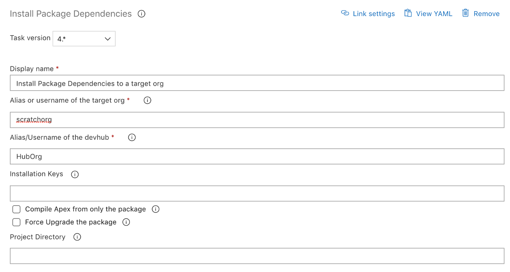

# Install package dependencies

This task is a wrapper over sfpowerkit:package:dependencies:install command. It is used to install any unlocked or managed package dependencies for an unlocked package

| Task Id | Version |
| :--- | :--- |
| sfpowerscript-installpackagedependencies-task | 5.0.5 |

**Prerequisites**

[Install SFDX CLI with sfpowerkit](install-sfdx-cli-with-sfpowerkit.md) task must be added to the pipeline before utilizing this task

**Task Snapshot**



**Parameters**



Classic Designer Labels are in **Bold,** YAML Variables are in _italics_

* **Alias or username of the target org /** _target\_org_ Username or alias of the target org on which the source directory is to be deployed 
* **Alias/Username of the devhub** / _devhub\_alias_ Provide the alias or username of the devhub which houses the unlocked packages 
* **Installation Keys** / _keys_ Installation key for key-protected packages in the dependencies _**Format:**_ 1:MyPackage1Key 2: 3:MyPackage3Key This format allows for a mixture of packages with and without installation keys 
* **Compile Apex from only the package** / _checkonly_ Specifies whether to compile all Apex in the org and package or only the Apex in the package 
* **Force upgrade the package /** _forceinstall_ Update all packages even if they are installed in the target org 
* **Project Directory /** _working\_directory_ The path to the folder directory containing the sfdx-project.json file.  _**Note:**_ Leave blank if the sfdx-project.json is in the root of the repository 



None



None



```text
 - task: sfpowerscript-installpackagedependencies-task@2
            displayName: 'Install Package Dependencies to a target org'
            inputs:
              apexcompileonlypackage: true
              target_org: 'scratchorg'
              devhub_alias: 'HubOrg'
```



**Changelog**

* 4.0.9 Update Core dependency
* 4.0.4 Remove Telemetry collection
* 3.0.9 Refactored to use revamped folder structure
* 2.0.1 Updated with Telemetry
* 1.8.0 Initial Version

