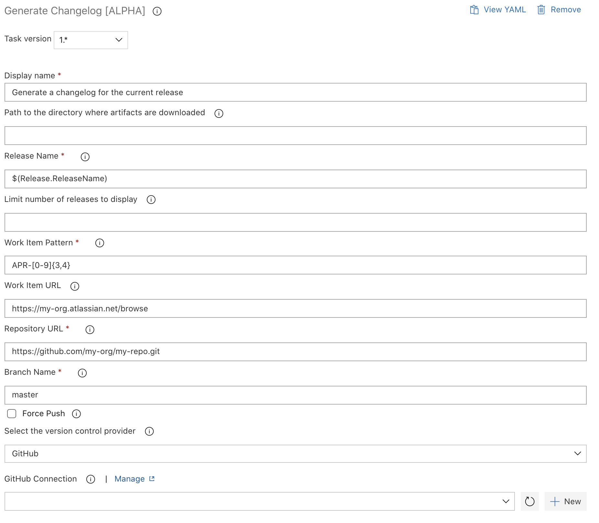

# Generate Changelog \[ALPHA\]

| Task ID | Version |
| :--- | :--- |
| ​sfpowerscripts-generatechangelog-task | ​1.0.0 |

Generates a release change log that summarises artifact versions, work items \(user stories\) and commits that have been introduced in the release. 

#### 

#### Task Snapshot



#### Parameters



Classic Designer Labels are in **Bold,**  YAML Variables are in _italics_

* **Path to the directory where artifacts are downloaded** / _aritfactDir_

  Path to the artifact directory where the artifacts are downloaded, If not provided, the default values will be automatically used

* **Release Name** / _releaseName_

  Name of the release to be displayed in the changelog

* **Limit number of releases to display** / _limit_

  Limit the number of releases to display in the changelog markdown

* **Work Item Pattern** / _workItemFilter_

  Pattern used to match work item or user story IDs. Accepts regular expressions e.g. APR-\[0-9\]{3,4}

* **Work Item URL** / _workItemUrl_

  Generic URL that points to work items. Each work item ID will be appended to the URL, providing quick access to work items

* **Repository URL** / _repositoryUrl_

  Repository in which changelog files will be located

* **Branch Name** / _branchName_

  Name of the repository branch in which changelog files will be located

* **Force Push** / _forcePush_

  Warning: ignores conflicts and overrwrites branch

* **Select the version control provider /** _versionControlProvider_  
  The version control provider that hosts the particular repository. Select the appropriate repository type from the drop down \(in UI\) or pass the name of the service connection. You can read more on using service connections  [here](https://docs.microsoft.com/en-us/azure/devops/pipelines/library/service-endpoints?view=azure-devops&tabs=yaml).

  
  The supported options are    
  
  -  **Github Connection /** github\_connection  
    Use this if your repository  provider is GitHub  
  -  **GitHub Enterprise Connection /** _github\_enterprise\_connection_   
     Use this if your repository provider is GitHub Enterprise  
  __**- Bitbucket Connection /** _bitbucket\_connection_  
     ****Use this if your repository provider is Bitbucket  
  **- Azure Repo /** _azureRepo_  
   ****Use this if your repository provider is Azure Repo. Please ensure the agent has the right permissions for authenticating to the Azure Repo \( enabled by  '[Allow Scripts to access the OAuth Token'](https://docs.microsoft.com/en-us/azure/devops/pipelines/build/options?view=azure-devops#allow-scripts-to-access-the-oauth-token) \)  
  **- Other Git /** _otherGit_  
   ****Any other Git provider which can be authenticated using a username/password based basic authentication schema.  
  - **Git which is already authenticated at the agent level /** hostedAgentGit  
  Use this option if the agent is already authenticated to Git repository \(typically used in a self hosted agent or if none of the above methods are not suffice to connect to your git repository\)



```text
steps:
- task: AzlamSalam.sfpowerscripts-alpha.sfpowerscripts-generatechangelog-task.sfpowerscripts-generatechangelog-task@1
  displayName: 'Generate a changelog for the current release'
  inputs:
    releaseName: '$(Release.ReleaseName)'
    workItemFilter: 'APR-[0-9]{3,4}'
    workItemUrl: 'https://my-org.atlassian.net/browse'
    repositoryUrl: 'https://github.com/my-org/my-repo.git'
    branchName: master
```



#### Changelog

* 1.0.0 Initial version

