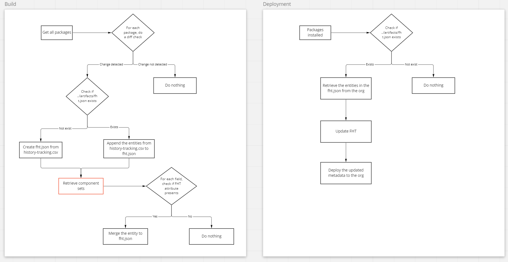

# Field history tracking resolution

* Status: <!-- optional -->
* Issue: <!-- optional -->
* Deciders: <!-- optional -->
* Date:  <!-- optional -->

## Context and Problem Statement

In Salesforce, field history tracking can only be deployed from source packages. The current implementation of sfpowerscripts keeps a copy of all the fields that need to be tracked in a separate source package (field-history-tracking) and deploys it as a post deployment step. However, as the number of fields increases in large-scale projects, the folder becomes larger and difficult to maintain. In addition, since it's often the case that the project does not own the metadata definition of fields from managed packages, it doesn't make much sense to carry the metadata only for field history tracking purpose.

## Solution

To resolve this, the field-history-tracking package should be disabled and a mechanism needs to be implemented to automate the deployment of field history tracking. Specifically, for each unlocked package, a csv file (history-tracking.csv) that stores the list of all the tracked fields in that package is maintained in the postdeploy_transform folder.

During the build stage, if changes are detected in a package (and also in the history-tracking.csv), a temporary json file that consists of the tracked fields will be generated from the csv and stored in artifacts. In case that manual updates on the csv file are missing due to human mistake, a filtering process will also be performed on the fields in the changed packages, any fields that have changes on the history tracking attributes (trackHisotry and trackFeedHistory) will be written to the json file.

After package installation, the entities in the json file will be retrieved from the org and redeployed after updating the history tracking attributes.

