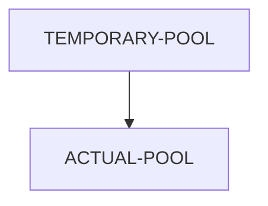

# Ability to do prepare using multiple stages

* Status: Accepted  <!-- optional -->
* Deciders: Azlam
* Date: 01-06-2022

## Context and Problem Statement

Prepare can take extremely long hours on some repos often running out of time in hosted ci agents which are set at 3 or 6 hours depending on the platform. This has resulted in prepare unable to be completed as the host job results in timeout leaving all the scratch orgs in the pool in 'In Progress' state. Though the recommended approach will be to use hosted agents to overcome this time restriction, many of the users can't afford to use hosted agents due to maintenance costs. sfpowerscripts should provide an option to mitigate the above restriciton.

## Decision

sfpowerscripts will provide an ability to daisychain prepare command where a pool prepared in a job/stage can be used by another job. This is introduced by adding an additional flag called snapshotPool in the pool config. 

To illustrate it, one could have prepare in the below configuration

An agent could be allocated for building the temporary pool, (say only for installing external dependencies by removing installAll or by dynamically modifying sfdx-project.json) to ensure it is done within the timeout window. Once TEMPORARY-POOL is completed, the ACTUAL-POOL job which is configured to utilize TEMPORARY-POOL will fetch the scratch orgs from TEMPORARY-POOL and then install the remaining packages, using `deploy` 's ability to skip packages that are already installed. As ACTUAL-POOL only fetches scratch orgs from TEMPORARY-POOL which are in `Available` state, the temporary pool itself could also be used as a normal pool

This also will allow a `sfpowerkit` pool which has ability to use scripts to be connected to `sfpowerscripts` pool to do activities such as pre deployment scripts for better controlling environment provisioning.