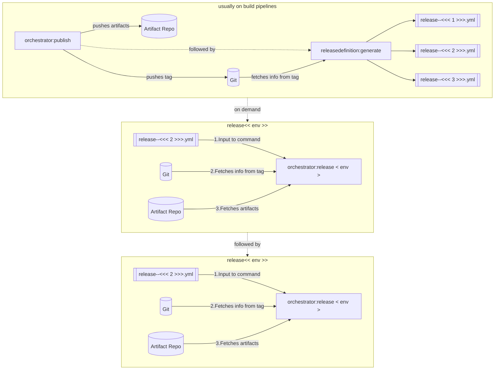

# Automatic generation of release definition

* Status: Review  <!-- optional -->
* Deciders: Azlam, Vu, Zhebin <!-- optional -->
* Date: 15/08/22 <!-- optional -->

## Context and Problem Statement

sfpowerscripts allow a release manager to utilize  'LATEST_GIT_TAG' or to use 'SPECIFIC_VERSION' of a package in a release definition file. If the frequency of a deployment is very frequent to higher environments such as ST, users typically utilize release definition file with packages set to LATEST_GIT_TAG. During the execution of the release command, the exact versions of the artifacts are dynamically resolved to exact versions. If a user has to understand which versions of package constituting a release, users need to check the execution logs or changelog. sfpowerscripts  should provide a solution to ease this problem and ensure releases are fully traceable and recorded in version control

## Decision

sfpowerscripts will introduce a new command 'releasedefinition:generate' that can be used to generate a release definition file, The generatated release definiton  can then be used as an input to 'orchestrator:release' to deploy artifacts in the pipeline.



The command need a mechanism to figure out  versions of articats that constitute a release. This can be either done by utilizing an org as a reference or pointing to a particular commit reference.  

The mechanism of using Org as a source of truth, was discarded due to the following reasons:

* Version of artifacts in an org could be impacted by developer actions such as installing a package locally, without necessarily using sfpowerscripts command leaving the org in an incorrect state. This will result in a incorrect release definition that doesnt match the state of the particular org.
* Strong dependency on an org in the pipeline is against the guidelines in DX@Scale principles, as any org could be refreshed at any point in time.
* An org could be installed with artifacts created from 'quick build' stage. However these artifacts are typically not published in to the artifacts repositoy

However, using tags on the version control closely matches the existing behaviour of the release command with 'LATEST_GIT_TAG', but provide additional traceability  by providing the user ability to generate and store the release defintions in version control. These versioned release defintions then could be used on demand at any point in time.

The command will utilize a schema to generate the release  definition. This allows the user for flexibility in terms of selecting artifacts

```
---

# Include only the below artifacts
includeOnlyArtifacts:
  - Package1
  - Package2
# Exclude the following artifacts while creating definition
excludeArtifacts:
  - Package1
  - Package2
# Include  the following package dependencies  while creating definition
includeOnlyPackageDependencies:
 - Pkg1
# Include any artifacts that have the following tags
includeOnlyArtifactsWithTag:
  - tag1
# Exclude any artifacts that have the following tags
excludeArtifactsWithTag:
  - tag1
# Exclude the following package dependecies from the generated definition
excludePackageDependencies:
 - Pkg1
# set below properties in generated release definition 
baselineOrg: << org >>
promotePackagesBeforeDeploymentToOrg: << org >>
skipIfAlreadyInstalled: <<whether to skip artifacts installed >> 
changelog:
  workItemFilters:
    -  <<regex pattern1>>
    -  <<regex pattern2>>
  workItemUrl: <<alm url>>
  limit: <<changelog count limit>>

```

***Implementation notes***

1. The command should expect the name of the release as an input. The passed in name will be substituted in the generated release file
2. The command is expectected to be used from any stage in the repository
3. The input definition to this file will be called as *release definition config*
4. Packages defined in sfdx-project.json will be filtered by the inputs in release definition config
5. IncludeOnly or ExcludeArtifacts are mutually exclusive, with include taking precedence over exclude
6. PackageDependencies are picked from the packageAliases 
