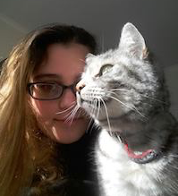

# Maintainers

Azlam is a Tech Architect with a particular interest on delivering iterative software. He is passionate on developer enablement utilizing plugins, frameworks along with automation. These days, he is focused on improving the speed and quality of Salesforce Development

Alan is a software developer who is currently focused on DevOps and automation within the Salesforce domain. When he's not coding, he can be found at the gym, sampling the coffee at the local cafe or getting stuck in a new book.

Caitlyn is an Application Development Associate currently specialising in Salesforce DevOps Engineering. She has software degree in Game Design and is currently enjoying playing Luigi's Mansion, Diablo III and Just Dance. 

