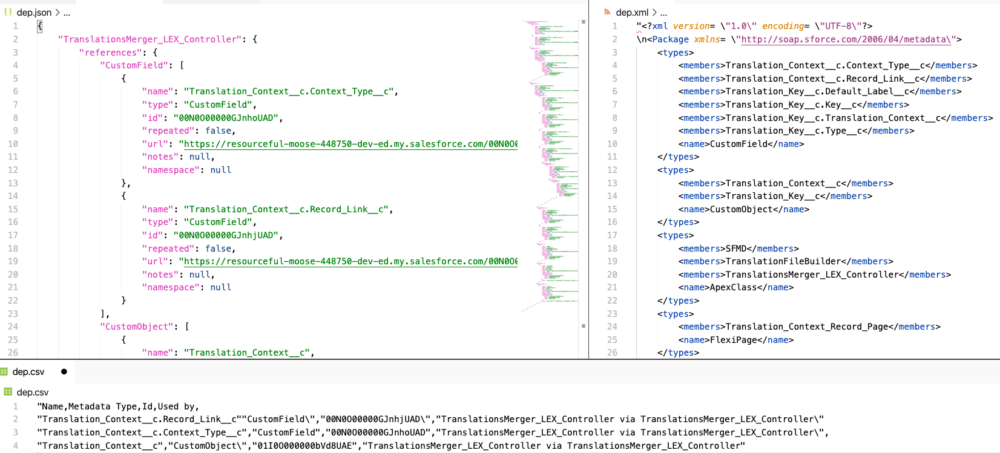

# sfdc-soup
## A simple API to understand your Salesforce dependencies

### Forked from https://github.com/pgonzaleznetwork/sfdc-soup for faster dependency updates for @dxatscale libs.  Feature Requests issues will be maintained in original sfdc-soup

`sfdc-soup` is the NPM library that powers the [Salesforce Happy Soup](https://github.com/pgonzaleznetwork/sfdc-happy-soup#the-best-way-to-visualize-your-salesforce-dependencies). 

It is simple API that allows you to see usage (i.e "where is this used?") and dependency (aka [deployment boundaries](https://github.com/pgonzaleznetwork/sfdc-happy-soup#deployment-boundaries)) information of a metadata member in your Salesforce org.

This information is provided in 4 different formats:

* **Excel and CSV** Perfect for sharing with other members of the team and brainstorming (for example when deciding how to optimize a page layout that has too many fields).
* **JSON tree** Useful to build tree-like UIs like the one seen on [Salesforce Happy Soup](https://github.com/pgonzaleznetwork/sfdc-happy-soup#the-best-way-to-visualize-your-salesforce-dependencies)
* **package.xml** So that you can immediately retrieve your deployment boundary and create a scratch org or unlocked package.
* **Stats** A simple object counting how many members of a specific metadata type are referenced. Useful for building UI dashboards.

```javascript

let standardField = {
    name:'Opportunity.StageName',
    type:'StandardField',
    id:'Opportunity.StageName',
}

let soupApi = sfdcSoup(connection,standardField);

let usageResponse = await soupApi.getUsage();
let dependencyResponse = await soupApi.getDependencies();

fs.writeFileSync('examples/usage.json',JSON.stringify(usageResponse.usageTree));
fs.writeFileSync('examples/dependencies.json',JSON.stringify(dependencyResponse.dependencyTree));


```

<p align="center">
  
</p>

## Contents

- [sfdc-soup](#sfdc-soup)
  - [A simple API to understand your Salesforce dependencies](#a-simple-api-to-understand-your-salesforce-dependencies)
    - [Forked from https://github.com/pgonzaleznetwork/sfdc-soup for faster dependency updates for @dxatscale libs.  Feature Requests issues will be maintained in original sfdc-soup](#forked-from-httpsgithubcompgonzaleznetworksfdc-soup-for-faster-dependency-updates-for-dxatscale-libs--feature-requests-issues-will-be-maintained-in-original-sfdc-soup)
  - [Contents](#contents)
  - [Installation](#installation)
  - [How to use](#how-to-use)
  - [Exploring the response](#exploring-the-response)
    - [`packageXml`](#packagexml)
    - [`dependencyTree`](#dependencytree)
    - [`stats`](#stats)
    - [`csv` and `excel`](#csv-and-excel)
  - [Pills](#pills)
  - [EntryPoint Options](#entrypoint-options)
  - [Support and help](#support-and-help)


## Installation

In your NPM application folder, run the following command

`npm install sfdc-soup`

Once you have installed the module in your own NPM project, you can import it in this way

```javascript
const sfdcSoup = require('sfdc-soup');
```

## How to use

Before using the API, you must have an `entryPoint` and `connection` objects.

**Entry Point**

The `entryPoint` is an object with 3 properties, all of which represent the entry point of the dependency tree. For example

```javascript
/**
* @name The API name of the metadata member
* @type The metadata type. It must match the Metadata API naming conventions
* @id The 18-digit id. The 15 digit one will NOT work
*/
let entryPoint = {
    name:'TranslationsMerger_LEX_Controller',
    type:'ApexClass',
    id:'01p0O00000CBlzZQAT'
}
```

How your construct this object is not a concern of `sfdc-soup`. Your application must use the relevant Salesforce APIs to get this information.

**Connection**

The `connection` is also an object with 3 properties that represent a valid API session with any given salesforce org. For example

```javascript
/**
* @token A session id or oauth token with API access
* @url Your instance url i.e login.salesforce.com or mydomain.my.salesforce.com
* @apiVersion the version of the Salesforce API. If not specified or if it's lower than 49.0, we use 50.0 by default
*/
let connection = {
    token: '00D0O000000Z9Ab!AQMAQMRoLQKh_uBxWEvz3as7V...',
    url:'https://resourceful-moose-448750-dev-ed.my.salesforce.com',
    apiVersion:'49.0'
};
```

How your construct this object is not a concern of `sfdc-soup`. Your application must use the relevant Salesforce APIs to get this information.


**Getting usage information**

To see where a metadata member is used, use the usageApi provided by `sfdc-soup` as follows

```javascript 
//async function
let soupApi = sfdcSoup(connection,entryPoint);
let usageResponse = await soupApi.getUsage();
```

```javascript 
//standard promise syntax
let soupApi = sfdcSoup(connection,entryPoint);
soupApi.getUsage().then(response => console.log(response));
```

**Getting dependency information (deployment boundary)**

To see the [deployment boundary](https://github.com/pgonzaleznetwork/sfdc-happy-soup#deployment-boundaries) of a metadata member, use the dependencyApi provided by `sfdc-soup` as follows

```javascript 
//async function
let soupApi = sfdcSoup(connection,standardField);
let dependencyResponse = await soupApi.getDependencies();
```

```javascript 
//standard promise syntax
let soupApi = sfdcSoup(connection,standardField);
soupApi.getDependencies().then(response => console.log(response));
```

[Back to top](#sfdc-soup)

## Exploring the response

Both the `usageApi` and `dependencyApi` provide the exact same properties in their response. Here we'll show the response properties of the `dependencyApi` simply because that is the most interesting one.

### `packageXml`

The `packageXml` property provides a string representing the package.xml required to retrieve all the metadata members from your org. The metadata members are those in the deploment boundary as well as the entry point.

It can be accessed via `dependencyResponse.packageXml`


```javascript
 "packageXml": "<?xml version=\"1.0\" encoding=\"UTF-8\"?>\n        <Package xmlns=\"http://soap.sforce.com/2006/04/metadata\"><types><members>Translation_Context__c.Context_Type__c
 </members><members>Translation_Context__c.Record_Link__c</members><members>Translation_Key__c.Default_Label__c</members><members>Translation_Key__c.Key__c
 </members><members>Translation_Key__c.Translation_Context__c</members></types><version>49.0</version>\n        </Package>",
```

### `dependencyTree`

The `dependencyTree` property is a JSON tree reprensenting the entire deployment boundary, where the entryPoint is the top key of the tree.

Every time a metadata member references (or depends on) another set of metadata, the tree expands via a `references` property on the metadata member.

```javascript
"dependencyTree": {
        "TranslationsMerger_LEX_Controller": {
            "references": {
                "CustomField": [
                    {
                        "name": "Translation_Context__c.Context_Type__c",
                        "type": "CustomField",
                        "id": "00N0O00000GJnhoUAD",
                        "repeated": false,
                        "url": "https://resourceful-moose-448750-dev-ed.my.salesforce.com/00N0O00000GJnhoUAD",
                        "notes": null,
                        "namespace": null
                    },
                    {
                        "name": "Translation_Context__c.Record_Link__c",
                        "type": "CustomField",
                        "id": "00N0O00000GJnhjUAD",
                        "repeated": false,
                        "url": "https://resourceful-moose-448750-dev-ed.my.salesforce.com/00N0O00000GJnhjUAD",
                        "notes": null,
                        "namespace": null
                    }
                ],
                "CustomObject": [
                    {
                        "name": "Translation_Context__c",
                        "type": "CustomObject",
                        "id": "01I0O000000bVd8UAE",
                        "repeated": false,
                        "url": "https://resourceful-moose-448750-dev-ed.my.salesforce.com/01I0O000000bVd8UAE",
                        "notes": null,
                        "namespace": null,
                        "references": {
                            "FlexiPage": [
                                {
                                    "name": "Translation_Context_Record_Page",
                                    "type": "FlexiPage",
                                    "id": "0M00O000000YF9SSAW",
                                    "repeated": false,
                                    "url": "https://resourceful-moose-448750-dev-ed.my.salesforce.com/0M00O000000YF9SSAW",
                                    "notes": null,
                                    "namespace": null,
                                    "referencedBy": {
                                        "name": "Translation_Context__c",
                                        "id": "01I0O000000bVd8UAE",
                                        "type": "CustomObject"
                                    }
                                }
                            ]
                        }
                    }
                ],
                "ApexClass": [
                    {
                        "name": "TranslationFileBuilder",
                        "type": "ApexClass",
                        "id": "01p0O00000CBltlQAD",
                        "repeated": false,
                        "url": "https://resourceful-moose-448750-dev-ed.my.salesforce.com/01p0O00000CBltlQAD",
                        "notes": null,
                        "namespace": null,
                        "references": {
                            "CustomField": [
                                {
                                    "name": "Translation_Key__c.Type__c",
                                    "type": "CustomField",
                                    "id": "00N0O00000GJmhdUAD",
                                    "repeated": false,
                                    "url": "https://resourceful-moose-448750-dev-ed.my.salesforce.com/00N0O00000GJmhdUAD",
                                    "notes": null,
                                    "namespace": null,
                                    "referencedBy": {
                                        "name": "TranslationFileBuilder",
                                        "id": "01p0O00000CBltlQAD",
                                        "type": "ApexClass"
                                    }
                                }
```

**NOTE**: In the `usageApi` this property is called `usageTree`.

[Back to top](#sfdc-soup)

### `stats`

The  `stats` object is the output of a `reducer` function. You can use this to know how many metadata members are using or are being used by a specific metadata member.

```javascript
"stats": {
        "CustomField": 6,
        "CustomObject": 2,
        "ApexClass": 2,
        "FlexiPage": 1
    }
```

You could also use this information to build charts with javascript

### `csv` and `excel`

These two properties return a string representing all the metadata members in either `csv` or `excel` format. 

```csv
"Name,Metadata Type,Id,Url,Used by,
"Translation_Context__c.Record_Link__c""CustomField\","00N0O00000GJnhjUAD\",
"https://resourceful-moose-448750-dev-ed.my.salesforce.com/00N0O00000GJnhjUAD\",
\"TranslationsMerger_LEX_Controller via TranslationsMerger_LEX_Controller\",
\r\n\"Translation_Context__c.Context_Type__c\",\"CustomField\",\"00N0O00000GJnhoUAD\",\"https://
resourceful-moose-448750-dev-ed.my.salesforce.com/00N0O00000GJnhoUAD\",
\"TranslationsMerger_LEX_Controller via TranslationsMerger_LEX_Controller\",
\r\n\"Translation_Context__c\",\"CustomObject\",\"01I0O000000bVd8UAE\",\"https://
resourceful-moose-448750-dev-ed.my.salesforce.com/01I0O000000bVd8UAE\",\"TranslationsMerger_LEX_Controller via TranslationsMerger_LEX_Controller\"

```

[Back to top](#sfdc-soup)

## Pills

When using the `usageApi`, the metadata types will return a `pills` object that contains additional information about the metadata type and how it is referencing the entry point in question.

Your client code should check if the `pills` object is populated (i.e if it has keys) and if so, display them in your UI.

Here's an example of how the `pills` object shows whether a custom field is being used for reading or writing (assignment) in an apex class

```javascript
 "ApexClass": [
        {
            "name": "ClassWritingToField",
            "type": "ApexClass",
            "id": "01p3h00000FHNeiAAH",
            "url": "https://brave-raccoon-mm7crl-dev-ed.my.salesforce.com/01p3h00000FHNeiAAH",
            "notes": null,
            "namespace": null,
            "pills": [
                {
                    "label": "write",
                    "color": "#d63031"
                }
            ],
            "sortOrder": 1
        },
        {
            "name": "ClassReadingField",
            "type": "ApexClass",
            "id": "01p3h00000FHNedAAH",
            "url": "https://brave-raccoon-mm7crl-dev-ed.my.salesforce.com/01p3h00000FHNedAAH",
            "notes": null,
            "namespace": null,
            "pills": [
                {
                    "label": "read",
                    "color": "#3c9662"
                }
            ],
            "sortOrder": 2
        }
```

[Back to top](#sfdc-soup)

## EntryPoint Options

When using the `usageApi` some metadata types support additional information that is not returned by the API unless explictly requested.

Consider the following example

```javascript
let customField = {
    name:'Account.CustomerPriority__c',
    type:'CustomField',
    id:'00N3h00000DdZSIEA3',
    options:{
        'enhancedReportData':true,
        'fieldInMetadataTypes':true
    }
}
```

With the additional options object, the API response will provide the following info:

`enhancedReportData`

This will tell you exactly how a field is used in a report; whether it's just a column, a filter or perhaps a grouping. To protect your API limits, this information is only available for the first 100 reports that are using the field. 

 The data can be found in the `pills` object of the response. 

Here's an example where the field is being used as both a filter and a grouping in the same report. Notice that the filter includes information on what the actual filter value is.

This can be very useful when determining if it's safe to modify a picklist value, as doing so could break some reports. 

```javascript
"Report": [
        {
            "name": "Report_being_used",
            "type": "Report",
            "id": "00O3h0000049mk4EAA",
            "url": "https://brave-raccoon-mm7crl-dev-ed.my.salesforce.com/00O3h0000049mk4EAA",
            "notes": null,
            "namespace": null,
            "pills": [
                {
                    "label": "Grouping",
                    "color": "#d63031"
                },
                {
                    "label": "Filter: equals Low",
                    "color": "#d63031"
                }
            ],
            "sortOrder": 1
        }
```

`fieldInMetadataTypes`

This will check if the field is being referenced in custom fields of custom metadata types, where the field type is `Metadata Relationship(Field Definition)`

This particular option does not add additional information to the `pills` object but instead returns a brand new metadata type on the response. 

```javascript
"SRM_Metadata_Conflict_Warning__mdt": [
        {
            "name": "Default (from SRM_Field__c)",
            "type": "SRM_Metadata_Conflict_Warning__mdt",
            "id": "m013h000000BRlrAAG",
            "url": "https://brave-raccoon-mm7crl-dev-ed.my.salesforce.com/m013h000000BRlrAAG",
            "notes": null,
            "pills": []
        }
    ],
    "Field_referencing__mdt": [
        {
            "name": "my_metadata (from Related_Field__c)",
            "type": "Field_referencing__mdt",
            "id": "m043h000000lprZAAQ",
            "url": "https://brave-raccoon-mm7crl-dev-ed.my.salesforce.com/m043h000000lprZAAQ",
            "notes": null,
            "pills": []
        }
    ]
```


[Back to top](#sfdc-soup)

## Support and help

Feel free to contact me at pgonzaleznetwork@gmail.com or log a github issue. 