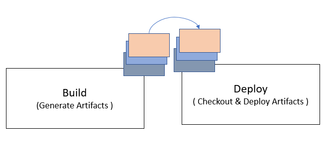

# Principles

## Ease of use

The tasks or commands should be easy to use. You don't need to resort to complex scripts to build a pipeline. A knowledge of what you need to achieve from a pipeline and Salesforce development \(such as [Salesforce DX](https://developer.salesforce.com/docs/atlas.en-us.sfdx_dev.meta/sfdx_dev/sfdx_dev_intro.htm), [Unlocked Package](https://developer.salesforce.com/docs/atlas.en-us.sfdx_dev.meta/sfdx_dev/sfdx_dev_unlocked_pkg_intro.htm)/[Org Based Deployment Model](https://trailhead.salesforce.com/content/learn/modules/org-development-model) or a Hybrid where you combine both\*\) should be enough to get you going.

We will also strive to provide sample pipelines to quickly get you started. **For sample pipelines checkout this** [**repo**](https://github.com/dxatscale/easy-spaces-lwc/tree/develop/.azure-pipelines)\*\*\*\*

\*If you need a refresher on Salesforce DX, Unlocked Packages or Org Based Deployment, checkout some of the available trailhead modules [here](https://trailhead.salesforce.com/en/users/azlam/trailmixes/salesforce-dx)

## Everything is a package

sfpowerscripts is built on the concept of generating artifacts for package creation tasks, unlocked or not, which then could be versioned, uploaded into an artifact provider or utilised in subsequent release stages for deployment across environments.

The following package creation commands shows this in action

* Create Source Package
* Create Unlocked Package
* Create Data Package \(for Records Based Configuration\)

These commands create an artifact named`<package_name>_sfpowerscripts_artifact_<ver>.zip`. This zip file contains the following items

| Item | Description |
| :--- | :--- |
| artifact\_metatadata.json | A JSON based manifest that contains information about the package |
| changelog.json | A JSON based schema that carries all commit description about the package |
| source | A directory containing the metadata in source format |

## Optimised for speed without hampering traceability

One of the common questions that is often asked to us is:

_**Does deploying packages compared to delta deployments \(deploys only what is changed between two commits or a range of commits\) make the overall deployment slower?**_

As packages are always deployed in its entirety, this is an understood fact. sfpowerscripts will always be built with features to optimize for speed but still ensuring the org is traceable compared to the traditional happy soup model most organisations are burdened with today.

Features currently enabling this principle include

* All sfpowerscripts package creation commands feature a diff check, which builds the package only if it detects a change 
* Packages will only be installed in the org, if the given package is not installed in the org
* Support for mono repository, while working with multiple packages reduces overhead and overall complexity

Of course the onus is on developers to granulize packages, so that this could be achieved, but be assured the tooling is available.

